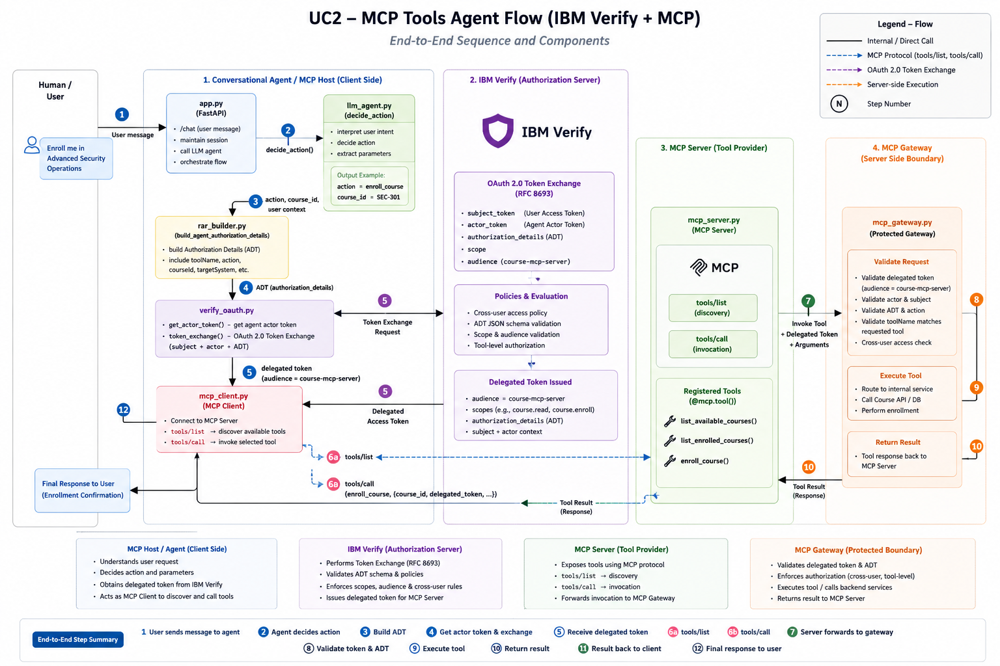

# Onboard & Secure a Conversational AI Agent with MCP Tool Integration

This sample demonstrates how to onboard a conversational AI agent as a governed **agent identity in IBM Verify** and secure the agent when it invokes tools exposed by a **Model Context Protocol (MCP) server** on behalf of a signed-in human user.

The example is a course assistant. A user signs in and asks:

```text
Show me the available courses.
Enroll me in Advanced Security Operations.
Show my enrolled courses.
Show Rick's enrolled courses.
```

The important difference from a direct-tool sample is **where the tools live and how they are invoked**.

```text
Direct tools
Agent code -> Python/API function

MCP tools
Agent / MCP Host -> MCP Client -> MCP Server -> registered MCP tool
```

In this UC2 sample, the FastAPI conversational application is the **MCP Host**. `mcp_client.py` is the **MCP Client**. `mcp_server.py` is the **MCP Server**. The MCP server registers three course tools with `@mcp.tool()` and the client discovers and invokes them with the standard MCP operations `tools/list` and `tools/call`.

Before the protected MCP tool is invoked, the application obtains the human subject token, obtains the registered agent's actor token, constructs MCP-specific authorization details, and asks IBM Verify to issue a delegated token through OAuth 2.0 Token Exchange.

The delegated token then travels with the local MCP tool invocation in this tutorial. The MCP server validates the delegated identity and authorization context before the course operation executes.



> Add the architecture PNG as `images/uc2-00-mcp-tools-agent-flow.png`.

## Why this sample matters

MCP standardizes how AI applications discover and call tools. An MCP server can expose functions, schemas, and descriptions to an MCP client. However, **tool discovery is not authorization**.

An agent may discover:

```text
list_available_courses
enroll_course
list_enrolled_courses
```

That only means the MCP server exposes those tools. It does not answer:

```text
Who is the human?
Which AI agent is acting?
May this agent act for this human?
Is this token intended for this MCP server?
Is enroll_course allowed for this delegated request?
Does the authorization detail match the actual MCP tool call?
```

IBM Verify is used to carry and evaluate the subject/actor security context before the tool call. The MCP server remains a protected resource boundary and validates the delegated token context before dispatching the tool.

## What the sample demonstrates

- Create the AI agent OAuth client with IBM Verify Dynamic Client Registration (DCR).
- Onboard the Course MCP Conversational Agent in IBM Verify Agent Registry.
- Associate the registered agent with its actor OAuth client.
- Authenticate the human through Authorization Code + PKCE.
- Authenticate the AI agent through Client Credentials.
- Build MCP-specific `authorization_details` containing the selected tool name and target MCP server.
- Exchange subject and actor tokens at IBM Verify STS.
- Request a delegated token for the `course-mcp-server` audience.
- Start a real MCP client session from the agent application.
- Discover server tools using MCP `tools/list`.
- Invoke the selected tool using MCP `tools/call`.
- Validate the delegated token context at the MCP server before tool execution.
- Deny a tool call when the actual MCP tool does not match the authorized `toolName`/`action`.
- Deny cross-user operations in the sample policy.

## MCP roles in this sample

This section is intentionally explicit because the words **agent**, **host**, **client**, and **server** are easy to mix up.

| Component | MCP role | Source file | Responsibility |
|---|---|---|---|
| Conversational Course Agent web app | MCP Host | `app.py` | User interaction, LLM/intent decision, IBM Verify flow, starts MCP calls |
| Course MCP client adapter | MCP Client | `mcp_client.py` | Connects to server, initializes MCP session, calls `tools/list` and `tools/call` |
| Course MCP tool service | MCP Server | `mcp_server.py` | Advertises MCP tools with `@mcp.tool()` |
| MCP authorization/execution boundary | Server-side security adapter | `mcp_gateway.py` | Validates delegated token context and executes permitted course operation |
| IBM Verify | Authorization server / STS | external | Subject authentication, actor token, token exchange and delegated token issuance |

### The one-line answer

```text
app.py is the MCP Host
mcp_client.py is the MCP Client
mcp_server.py is the MCP Server
```

### Who starts the MCP server?

The MCP client uses the official Python SDK `StdioServerParameters`:

```python
server_params = StdioServerParameters(
    command=sys.executable,
    args=[str(SERVER_SCRIPT)],
    env=None,
)
```

For this local tutorial, `mcp_client.py` launches:

```text
python mcp_server.py
```

as a child process and communicates with it over the MCP **STDIO transport**.

### Who is the MCP client?

`mcp_client.py` creates an MCP `ClientSession`:

```python
async with stdio_client(server_params) as (read_stream, write_stream):
    async with ClientSession(read_stream, write_stream) as session:
        await session.initialize()
```

That code is the MCP client connection.

### Who is the MCP server?

`mcp_server.py` creates the MCP server:

```python
from mcp.server.fastmcp import FastMCP

mcp = FastMCP("course-mcp-server")
```

and runs it with:

```python
mcp.run(transport="stdio")
```

### Which tools does the MCP server expose?

The server registers three Python functions as MCP tools:

```python
@mcp.tool()
def list_available_courses(...):
    ...

@mcp.tool()
def list_enrolled_courses(...):
    ...

@mcp.tool()
def enroll_course(...):
    ...
```

FastMCP uses the function name, type hints, and docstring to expose the tool definition to MCP clients.

## Sample architecture

```text
+---------------------------+
| Human user                |
| Browser / chat            |
+-------------+-------------+
              |
              | Login with IBM Verify
              v
+-------------+-------------------------------------------+
| Conversational Course Agent / MCP Host                  |
| app.py                                                   |
|                                                          |
|  1. decide_action(message)                               |
|  2. build MCP authorization_details                     |
|  3. get actor token                                     |
|  4. IBM Verify token exchange                           |
|  5. call_mcp_tool(...)                                  |
+-----------------------------+----------------------------+
                              |
                              v
+-----------------------------+----------------------------+
| MCP Client                                               |
| mcp_client.py                                            |
|                                                          |
| ClientSession.initialize()                               |
| session.list_tools()        -> MCP tools/list             |
| session.call_tool(...)      -> MCP tools/call             |
+-----------------------------+----------------------------+
                              |
                              | MCP over STDIO
                              v
+-----------------------------+----------------------------+
| MCP Server                                               |
| mcp_server.py                                            |
| name = course-mcp-server                                 |
|                                                          |
| @mcp.tool() list_available_courses                       |
| @mcp.tool() list_enrolled_courses                        |
| @mcp.tool() enroll_course                                |
+-----------------------------+----------------------------+
                              |
                              v
+-----------------------------+----------------------------+
| Server-side security and course operation                |
| mcp_gateway.py                                           |
|                                                          |
| audience -> actor -> scope -> ADT -> tool/action match   |
| -> subject policy -> execute permitted operation         |
+----------------------------------------------------------+
```

IBM Verify sits on the identity/token path before the MCP client calls the protected tool:

```text
Subject token + Actor token + MCP authorization_details
                         |
                         v
                  IBM Verify STS
                         |
                         v
Delegated token: aud = course-mcp-server
                         |
                         v
              MCP tools/call arguments
                         |
                         v
                 MCP Server validates
```

## Runtime flow

For this prompt:

```text
Enroll me in Advanced Security Operations.
```

the runtime flow is:

```text
1. Browser -> app.py /chat

2. app.py -> llm_agent.decide_action(message)

   AgentDecision(
       action="enroll_course",
       course_id="SEC-301",
       target_subject="self"
   )

3. app.py -> resolve_target_subject(...)

4. app.py -> rar_builder.build_agent_authorization_details(...)

   action           = enroll_course
   toolName         = enroll_course
   targetSystem     = course-mcp-server
   resource         = mcp-tool
   downstreamSystem = course-api

5. app.py -> verify_oauth.get_actor_token()

   POST /oauth2/token
   grant_type=client_credentials

6. app.py -> verify_oauth.token_exchange(...)

   subject_token        = human
   actor_token          = registered agent
   audience             = course-mcp-server
   authorization_details= MCP tool context

7. IBM Verify -> delegated access token

8. app.py -> mcp_client.call_mcp_tool(
       tool_name="enroll_course",
       delegated_token=<token>,
       course_id="SEC-301",
       ...
   )

9. mcp_client.py -> ClientSession.initialize()

10. mcp_client.py -> session.list_tools()

    MCP operation: tools/list

11. mcp_client.py confirms enroll_course is exposed

12. mcp_client.py -> session.call_tool(
        "enroll_course",
        arguments
    )

    MCP operation: tools/call

13. mcp_server.py receives the MCP tool invocation

14. @mcp.tool() enroll_course(...) runs

15. mcp_server.py -> mcp_gateway.invoke_mcp_tool(...)

16. mcp_gateway.py validates:

    audience
    actor
    scope
    authorization_details
    targetSystem
    resource
    downstreamSystem
    action
    toolName
    affectedPerson
    loggedInSubject
    cross-user policy

17. Only after validation passes is enrollment executed

18. MCP tool result -> MCP Client -> app.py -> human
```

## Project structure

```text
.
├── README.md
├── app.py                       # Conversational agent and MCP Host
├── mcp_client.py                # Real MCP ClientSession, tools/list, tools/call
├── mcp_server.py                # FastMCP server and @mcp.tool() registrations
├── mcp_gateway.py               # IBM Verify-aware server-side validation/dispatch
├── llm_agent.py                 # Natural language -> allow-listed action
├── rar_builder.py               # MCP-specific authorization_details
├── verify_oauth.py              # PKCE, actor token, OAuth token exchange
├── verify_directory.py          # Optional target-user resolution
├── course_api.py                # Optional downstream validation mode
├── token_utils.py               # Token claim helpers for the demo
├── config.py                    # Environment settings
├── templates/index.html         # Chat UI
├── mock_courses.json            # Sample course data
├── payloads/
│   └── agent_action_adt_schema.json
├── api-clients/
│   ├── postman/
│   └── insomnia/
├── curl/
├── docs/
└── images/
```

## Prerequisites

> **Python 3.11 or later is recommended for this sample.**

Check:

```bash
python --version
python -c "import ssl; print(ssl.OPENSSL_VERSION)"
```

Use a Python build backed by a current OpenSSL version.

You also need:

- An IBM Verify tenant with the OAuth/OIDC capabilities used by the sample.
- IBM Verify Agent Registry capability/API enabled in the target environment.
- Permission to configure Dynamic Client Registration.
- Permission to create/register an agent and associate an OAuth client.
- A subject OIDC application.
- An STS/token-exchange client.
- An MCP resource client/audience configuration for `course-mcp-server`.
- The Authorization Details Type used by this sample.
- An applicable IBM Verify STS policy/actor criteria.
- A Gemini API key only when `USE_LLM=true`.

## Step 1 — Create an IBM Verify administrative API client

Create an IBM Verify administrative/API client with the minimum entitlements required to perform the setup operations used in your tenant.

For bearer-protected DCR, IBM Verify documents the dynamic-client management entitlement required by the registration API.

Capture:

```text
ADMIN_CLIENT_ID=<admin API client ID>
ADMIN_CLIENT_SECRET=<admin API client secret>
```


Obtain the setup token:

```bash
curl --request POST "https://<tenant>/oauth2/token" \
  --header "Content-Type: application/x-www-form-urlencoded" \
  --data-urlencode "grant_type=client_credentials" \
  --data-urlencode "client_id=<admin-client-id>" \
  --data-urlencode "client_secret=<admin-client-secret>"
```

## Step 2 — Create the agent actor client using DCR

DCR is the preferred actor-client creation path in this sample.

```bash
curl --request POST "https://<tenant>/oauth2/register" \
  --header "Authorization: Bearer <admin-access-token>" \
  --header "Content-Type: application/json" \
  --data @curl/payloads/actor-client-dcr.json
```

Capture:

```text
ACTOR_CLIENT_ID=<client_id>
ACTOR_CLIENT_SECRET=<client_secret>
```


### Postman

Import:

```text
api-clients/postman/uc2-ibm-verify-setup.postman_collection.json
```

Run:

```text
01 - Get Admin Access Token
02 - DCR - Create UC2 Actor Client
```

The collection saves the standard `access_token`, `client_id`, and `client_secret` response values.

### Insomnia

Import:

```text
api-clients/insomnia/uc2-ibm-verify-setup.insomnia.json
```

Populate the base environment and run the same numbered requests. Copy returned values into the environment where needed.

## Step 3 — Onboard the MCP conversational agent and associate the actor client

The actor OAuth client authenticates the AI runtime. The Agent Registry record represents the governed Course MCP Conversational Agent.

```bash
export TENANT_URL="https://<tenant>"
export ADMIN_ACCESS_TOKEN="<admin-access-token>"
export ACTOR_CLIENT_ID="<actor-client-id>"
export ACTOR_CLIENT_REFERENCE="<client reference used by your tenant>"

curl --request POST "$TENANT_URL/v1.0/Agents" \
  --header "Authorization: Bearer $ADMIN_ACCESS_TOKEN" \
  --header "Accept: application/scim+json" \
  --header "Content-Type: application/scim+json" \
  --data "$(envsubst < curl/payloads/course-mcp-agent.json)"
```


Postman requests:

```text
03 - Create Agent and Associate Actor Client
04 - Get Agent Details
05 - Get Actor Token
06 - Introspect Actor Token
```

Note : Use the Agent onboarding tutorial to Onboard Agents properly and map to runtime OAuth Client.

## Step 4 — Configure the human subject application

Create the OIDC application used by the browser chat.

| Setting | Sample value |
|---|---|
| Grant | Authorization Code |
| PKCE | S256 / required |
| Redirect URI | `http://localhost:8000/callback` |
| Scopes | `openid profile email course.read course.enroll` |

Capture:

```text
SUBJECT_CLIENT_ID=<subject client ID>
SUBJECT_CLIENT_SECRET=<subject client secret>
```


## Step 5 — Create the MCP Authorization Details Type

The sample uses:

```text
urn:ibm:demo:verify:agent_action
```

Use the exact schema in:

```text
payloads/agent_action_adt_schema.json
```

The actual `rar_builder.py` payload is shaped like:

```json
[
  {
    "type": "urn:ibm:demo:verify:agent_action",
    "courseId": "SEC-301",
    "operationDetails": {
      "creator": "<actor-client-id>",
      "affectedPerson": "<target-subject>",
      "loggedInSubject": "<signed-in-subject>",
      "action": "enroll_course",
      "targetSystem": "course-mcp-server",
      "resource": "mcp-tool",
      "toolName": "enroll_course",
      "downstreamSystem": "course-api"
    }
  }
]
```

The schema included with this package matches these fields exactly.


### Why `toolName` matters

The token-exchange request is created **before** the MCP tool call. The authorization detail says:

```text
toolName = enroll_course
```

Later, the MCP client performs:

```python
await session.call_tool("enroll_course", arguments)
```

At the MCP server boundary, `mcp_gateway.py` compares the actual tool invocation with the authorized operation context.

The sample is designed to deny this mismatch:

```text
authorization_details.toolName = list_available_courses
actual MCP tools/call name      = enroll_course
```

Tool discovery therefore does not grant permission to reuse a delegated token for a different tool.

## Step 7 — Configure the STS / Token Exchange client

Configure an IBM Verify STS/token-exchange client for RFC 8693 token exchange.


The sample sends:

```text
grant_type          = urn:ietf:params:oauth:grant-type:token-exchange
subject_token        = human access token
subject_token_type   = urn:ietf:params:oauth:token-type:access_token
actor_token          = AI agent access token
actor_token_type     = urn:ietf:params:oauth:token-type:access_token
scope                 = mcp.tools.invoke course.read course.enroll
audience              = course-mcp-server
authorization_details = MCP tool invocation context
```

Capture:

```text
STS_CLIENT_ID=<STS client ID>
STS_CLIENT_SECRET=<STS client secret>
```


Add resource/audience

This sample asks IBM Verify to issue the delegated token for:

```text
course-mcp-server
```

The MCP invocation scope is:

```text
mcp.tools.invoke
```

The requested business scopes are:

```text
course.read
course.enroll
.

## Step 7 — Configure the application

```bash
cp .env.example .env
```

Populate:

```dotenv
APP_BASE_URL=http://localhost:8000
SESSION_SECRET=<random-local-session-secret>

USE_LLM=false
GEMINI_API_KEY=
GEMINI_MODEL=gemini-2.5-flash

VERIFY_ISSUER=https://<tenant>/oauth2
VERIFY_AUTHORIZATION_ENDPOINT=https://<tenant>/oauth2/authorize
VERIFY_TOKEN_ENDPOINT=https://<tenant>/oauth2/token
VERIFY_JWKS_URI=https://<tenant>/oauth2/jwks
VERIFY_INTROSPECTION_ENDPOINT=https://<tenant>/oauth2/introspect

SUBJECT_CLIENT_ID=<subject-client-id>
SUBJECT_CLIENT_SECRET=<subject-client-secret>
SUBJECT_REDIRECT_URI=http://localhost:8000/callback
SUBJECT_SCOPES=openid profile email course.read course.enroll

ACTOR_CLIENT_ID=<dcr-created-actor-client-id>
ACTOR_CLIENT_SECRET=<dcr-created-actor-client-secret>
ACTOR_SCOPES=agent.run

STS_CLIENT_ID=<sts-client-id>
STS_CLIENT_SECRET=<sts-client-secret>
STS_REQUESTED_SCOPE=mcp.tools.invoke course.read course.enroll
STS_AUDIENCE=course-mcp-server

MCP_AUDIENCE=course-mcp-server
MCP_SERVER_NAME=course-mcp-server
DOWNSTREAM_SYSTEM=course-api
MCP_FORWARD_TO_COURSE_API=false
COURSE_API_AUDIENCE=course-api

AGENT_ADT_TYPE=urn:ibm:demo:verify:agent_action
```

For the first run:

```dotenv
USE_LLM=false
```

After the complete IBM Verify and MCP flow works, enable Gemini.

## Step 8 — Install and run

Use Python 3.11 or later:

```bash
python3.11 -m venv .venv
source .venv/bin/activate
python -m pip install --upgrade pip
pip install -r requirements.txt
pip install pyJWT jinja2

uvicorn app:app --reload --host 0.0.0.0 --port 8000
```

Open:

```text
http://localhost:8000
```

The MCP server is **not started manually for the basic sample**. `mcp_client.py` launches `mcp_server.py` through `StdioServerParameters` when it establishes the MCP session.

## Step 9 — Prove the MCP server and client are working

Before testing the chat, call:

```bash
curl http://localhost:8000/mcp/tools
```

The FastAPI endpoint calls:

```python
await list_mcp_tools()
```

Inside `mcp_client.py`:

```python
response = await session.list_tools()
```

Expected tool names:

```text
list_available_courses
list_enrolled_courses
enroll_course
```

The response also shows:

```text
protocol_operation = tools/list
```

This proves that the tools were discovered from the MCP server rather than read from an `ALLOWED_ACTIONS` dictionary alone.

## Step 10 — Run the demo

### Test A — List available courses

Prompt:

```text
Show me the available courses.
```

Expected flow:

```text
decide_action()
 -> list_available_courses
 -> IBM Verify token exchange
 -> MCP Client tools/list
 -> MCP Client tools/call(list_available_courses)
 -> MCP Server @mcp.tool() list_available_courses()
 -> server-side token/ADT validation
 -> return available courses
```

### Test B — Enroll the signed-in user

Prompt:

```text
Enroll me in Advanced Security Operations.
```

Expected tool:

```text
enroll_course
```

Expected MCP call:

```python
await session.call_tool(
    "enroll_course",
    {
        "delegated_token": "...",
        "course_id": "SEC-301",
        "requested_subject": "<subject>",
        "logged_in_subject": "<subject>"
    }
)
```

Expected server function:

```python
@mcp.tool()
def enroll_course(...):
```

### Test C — Show the user's enrolled courses

Prompt:

```text
Show my enrolled courses.
```

Expected tool:

```text
list_enrolled_courses
```

### Test D — Attempt cross-user access

Prompt:

```text
Show Rick's enrolled courses.
```

Expected result:

```text
DENIED
```

The MCP server-side validation checks the requested and logged-in subject context before the tool operation executes.

## MCP tool registration and invocation

### 1. The server registers tools

`mcp_server.py`:

```python
mcp = FastMCP("course-mcp-server")

@mcp.tool()
def list_available_courses(...):
    ...

@mcp.tool()
def list_enrolled_courses(...):
    ...

@mcp.tool()
def enroll_course(...):
    ...
```

This is the MCP equivalent of publishing a tool catalog.

### 2. The client discovers tools

`mcp_client.py`:

```python
response = await session.list_tools()
```

MCP protocol operation:

```text
tools/list
```

The client obtains the tool names, descriptions, and input schemas from the MCP server.

### 3. The agent chooses the intended action

`app.py`:

```python
decision = decide_action(message)
action = decision.action
```

For:

```text
Enroll me in Advanced Security Operations
```

`llm_agent.py` returns:

```text
action        = enroll_course
course_id     = SEC-301
target_subject= self
```

### 4. IBM Verify authorization happens before the protected tool call

`app.py` builds MCP-specific authorization details and calls:

```python
actor_tokens = await get_actor_token()

exchanged_tokens = await token_exchange(
    subject_token=subject_token,
    actor_token=actor_token,
    authorization_details=authorization_details,
)
```

### 5. The MCP client calls the selected tool

`app.py`:

```python
mcp_result = await call_mcp_tool(
    delegated_token=delegated_token,
    tool_name=action,
    course_id=course_id,
    requested_subject=target_subject,
    logged_in_subject=logged_in_subject,
)
```

`mcp_client.py`:

```python
result = await session.call_tool(tool_name, arguments)
```

MCP protocol operation:

```text
tools/call
```

### 6. The MCP server receives the exact tool call

For `enroll_course`, FastMCP dispatches to:

```python
@mcp.tool()
def enroll_course(...):
```

The server then calls:

```python
invoke_mcp_tool(
    delegated_token=delegated_token,
    tool_name="enroll_course",
    ...
)
```

### 7. The protected MCP boundary validates before execution

`mcp_gateway.py` validates the actual invocation against the delegated token context.

| Validation | Question |
|---|---|
| Audience | Was the token issued for `course-mcp-server`? |
| Actor | Is the expected registered agent context present? |
| Scope | Does the delegated token permit MCP invocation and the business action? |
| ADT type | Is the configured agent-action detail present? |
| `targetSystem` | Is this authorization for this MCP server? |
| `resource` | Is the protected object an MCP tool? |
| `toolName` | Does the authorization match the actual MCP tool called? |
| `action` | Does the authorized business action match the tool? |
| Subject | Does the affected person match the requested subject? |
| Cross-user policy | Is the agent trying to act for another user? |

The business operation executes only after these checks pass.

## Complete source-level call flow

```text
app.py
chat()
  |
  +--> llm_agent.py
  |      decide_action(message)
  |
  +--> app.py
  |      resolve_target_subject(...)
  |
  +--> rar_builder.py
  |      build_agent_authorization_details(...)
  |
  +--> verify_oauth.py
  |      get_actor_token()
  |         +--> IBM Verify /oauth2/token
  |
  +--> verify_oauth.py
  |      token_exchange(...)
  |         +--> IBM Verify STS
  |
  +--> mcp_client.py                         [MCP CLIENT]
         call_mcp_tool(...)
           |
           +--> ClientSession.initialize()
           +--> session.list_tools()         [tools/list]
           +--> session.call_tool(...)       [tools/call]
                    |
                    v
              mcp_server.py                  [MCP SERVER]
                 @mcp.tool()
                 enroll_course(...)
                    |
                    v
              mcp_gateway.py
                 invoke_mcp_tool(...)
                    |
                    +--> _validate_mcp_invocation()
                    |
                    +--> _execute_tool_locally()
                    |
                    v
                 MCP tool result
                    |
                    v
              mcp_client.py
                    |
                    v
              app.py -> build_answer()
                    |
                    v
                 Human user
```

For a source-focused walkthrough, see:

```text
docs/mcp-client-server-tool-flow.md
```

## Local STDIO transport versus a remote MCP server

This tutorial uses MCP STDIO because it makes the client/server relationship easy to run from one repository:

```text
mcp_client.py
   |
   | starts python mcp_server.py
   v
STDIO MCP connection
```

The delegated token is included in the tool arguments so the server-side sample can validate IBM Verify context at the tool boundary.

For a **remote MCP server**, use an MCP HTTP transport and protect the HTTP resource according to the MCP authorization model. The MCP authorization specification requires bearer access tokens in the HTTP `Authorization` header for protected resource requests.

A production remote architecture would look like:

```text
Conversational Agent / MCP Host
          |
          | MCP Client
          | Authorization: Bearer <delegated token>
          v
Remote course-mcp-server
          |
          +--> validate IBM Verify access token
          +--> tools/list
          +--> tools/call
```

Do not blindly copy the tutorial's `delegated_token` tool argument into a public remote MCP API. The local STDIO approach keeps the sample self-contained; a remote HTTP deployment should integrate bearer-token validation at the MCP HTTP resource boundary.

## What to look for in the logs

The IBM Verify token-exchange request should show:

```text
subject_token        -> human token
actor_token          -> AI agent token
audience              -> course-mcp-server
authorization_details.operationDetails.action   -> selected action
authorization_details.operationDetails.toolName -> selected MCP tool
```

For enrollment:

```text
action   = enroll_course
toolName = enroll_course
```

At the MCP boundary, look for validation stages such as:

```text
audience
actor
scope
authorization_details
target_system
resource
downstream_system
action
tool_name
affected_person
logged_in_subject
cross_user_policy
```

## Verify the delegated token using introspection

Use the MCP resource client:

```bash
curl --request POST "https://<tenant>/oauth2/introspect" \
  --user "<mcp-resource-client-id>:<mcp-resource-client-secret>" \
  --header "Content-Type: application/x-www-form-urlencoded" \
  --data-urlencode "token=<delegated-access-token>"
```

Or use:

```text
api-clients/postman/uc2-runtime-diagnostics.postman_collection.json
```

Run:

```text
01 - Application Health
02 - MCP tools/list through client
03 - MCP tools/call through client
04 - Introspect Delegated Token as MCP Resource
```

## How the code works

### `app.py` — conversational agent and MCP Host

The `/chat` route owns the user interaction and agent orchestration. It does not implement the MCP server.

Its protected path is:

```text
prompt
 -> decide action
 -> build MCP authorization details
 -> actor token
 -> IBM Verify token exchange
 -> call_mcp_tool()
```

### `mcp_client.py` — MCP Client

This file is the explicit MCP client.

It imports:

```python
from mcp import ClientSession, StdioServerParameters
from mcp.client.stdio import stdio_client
```

It performs:

```python
await session.initialize()
await session.list_tools()
await session.call_tool(tool_name, arguments)
```

### `mcp_server.py` — MCP Server

This file is the explicit MCP server.

It creates:

```python
mcp = FastMCP("course-mcp-server")
```

and exposes three `@mcp.tool()` functions.

### `mcp_gateway.py` — protected server-side execution boundary

This module validates the IBM Verify delegated token context and compares the authorization details with the actual MCP tool invocation.

It is called **from the MCP server tool handler**.

### `llm_agent.py` — AI intent decision

The model/fallback parser chooses an allow-listed action. It does not issue a token and does not authorize the tool call.

### `rar_builder.py` — MCP operation context

This module adds MCP-specific fields:

```text
toolName
targetSystem = course-mcp-server
resource = mcp-tool
downstreamSystem = course-api
```

### `verify_oauth.py` — IBM Verify OAuth flow

This module implements:

```text
Authorization Code + PKCE
Client Credentials actor token
OAuth 2.0 Token Exchange
```

## Using Postman and Insomnia

### IBM Verify setup collection

```text
api-clients/postman/uc2-ibm-verify-setup.postman_collection.json
api-clients/insomnia/uc2-ibm-verify-setup.insomnia.json
```

### MCP runtime diagnostics

```text
api-clients/postman/uc2-runtime-diagnostics.postman_collection.json
api-clients/insomnia/uc2-runtime-diagnostics.insomnia.json
```

The browser login and dynamic per-prompt token exchange remain in the application because OAuth state, PKCE verifier, signed-in subject, selected tool, course ID, and authorization details are interaction-specific.

## Security controls demonstrated

| Control | Enforcement point |
|---|---|
| Human authentication | IBM Verify authorization flow |
| AI agent authentication | IBM Verify token endpoint |
| Agent/client association | IBM Verify Agent Registry |
| Delegated token issuance | IBM Verify STS / token exchange |
| MCP tool context | Authorization Details Type |
| Tool discovery | MCP Server `tools/list` |
| Tool invocation | MCP Client `tools/call` |
| MCP audience | MCP server-side validation |
| Tool/action match | `mcp_gateway.py` |
| Required scope | `mcp_gateway.py` |
| Cross-user denial | MCP protected-resource policy |

## Production considerations

This repository is a tutorial. Before production use:

- use a remote MCP transport appropriate to your deployment;
- validate bearer tokens at the MCP HTTP resource boundary for remote HTTP servers;
- validate JWT signatures with the issuer JWKS or introspect tokens;
- do not use unverified JWT decoding as the authorization validator;
- do not expose delegated tokens as normal business tool parameters in a remote public MCP API;
- keep LLM tool selection separate from authorization decisions;
- define least-privilege scopes per MCP tool or tool group;
- bind authorization context to the actual `tools/call` operation;
- prevent a token authorized for one tool from being reused for another tool;
- store secrets in a managed secret store;
- remove tutorial token/claim diagnostics;
- audit subject, actor, MCP server, tool name, target resource, authorization result, and tool result.

## Troubleshooting

### `invalid_authorization_details`

Use the included schema:

```text
payloads/agent_action_adt_schema.json
```

It matches the actual UC2 `rar_builder.py` output including:

```text
courseId
loggedInSubject
toolName
downstreamSystem
```

### `/mcp/tools` fails

Confirm the MCP SDK is installed:

```bash
python -c "import mcp; print(mcp.__file__)"
```

Then verify:

```bash
python mcp_server.py
```

The command waits for MCP STDIO messages. Stop it with `Ctrl+C`; it is normally launched by `mcp_client.py`.

### MCP client says the tool is not exposed

Call:

```bash
curl http://localhost:8000/mcp/tools
```

Confirm the selected action exactly matches a tool name returned by `tools/list`.

### Tool/action mismatch

Check:

```text
authorization_details.operationDetails.action
authorization_details.operationDetails.toolName
actual session.call_tool(tool_name, ...)
```

For this sample all three must match.

### Audience validation fails

Align:

```dotenv
STS_AUDIENCE=course-mcp-server
MCP_AUDIENCE=course-mcp-server
MCP_SERVER_NAME=course-mcp-server
```

### `mcp.tools.invoke` missing

Check:

```dotenv
STS_REQUESTED_SCOPE=mcp.tools.invoke course.read course.enroll
```

and the IBM Verify STS policy/configuration that grants requested scopes.

### Actor token fails

Confirm the DCR-created actor client permits Client Credentials and the requested actor scope is configured.

### Introspection fails with invalid client

Use the MCP resource client credentials. Do not substitute the STS client credentials unless the same client is explicitly configured as the protected resource in your architecture.

## IBM Verify documentation references

- IBM Verify DCR API: https://docs.verify.ibm.com/verify/reference/post_oauth2-register
- IBM Verify token endpoint: https://docs.verify.ibm.com/verify/reference/post_oauth2-token
- IBM Verify OAuth 2.0 Token Exchange: https://docs.verify.ibm.com/verify/docs/oauth-20-token-exchange
- IBM Verify token introspection: https://docs.verify.ibm.com/verify/reference/post_oauth2-introspect
- IBM Verify OAuth 2.0 overview: https://docs.verify.ibm.com/verify/docs/oauth-20

## MCP documentation references

- MCP introduction: https://modelcontextprotocol.io/docs/getting-started/intro
- MCP architecture: https://modelcontextprotocol.io/docs/learn/architecture
- Build an MCP server: https://modelcontextprotocol.io/docs/develop/build-server
- Build an MCP client: https://modelcontextprotocol.io/docs/develop/build-client
- MCP tools specification: https://modelcontextprotocol.io/specification/2025-06-18/server/tools
- Official MCP Python SDK: https://github.com/modelcontextprotocol/python-sdk
