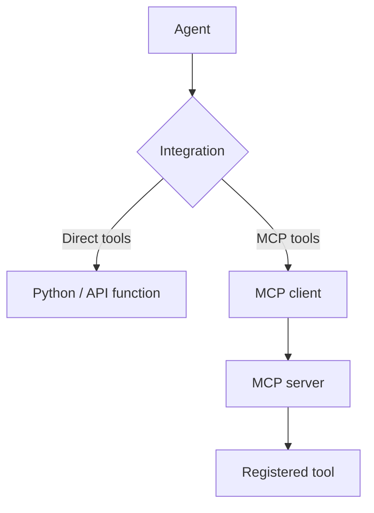
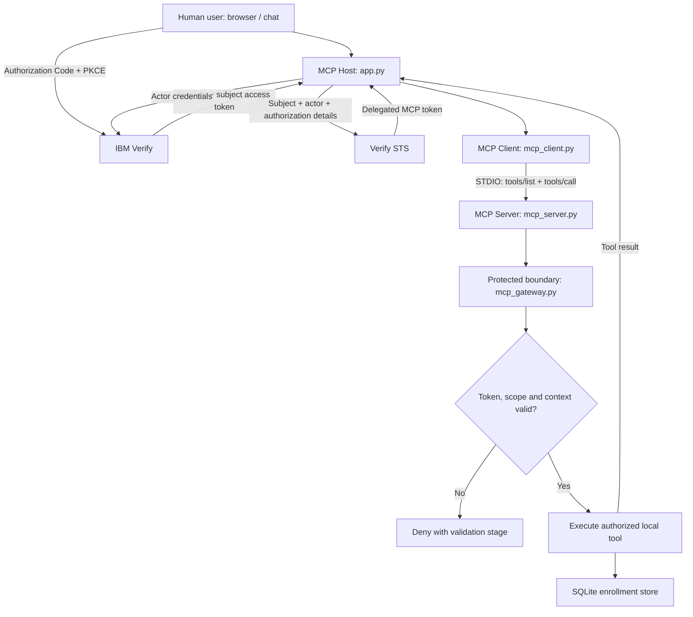
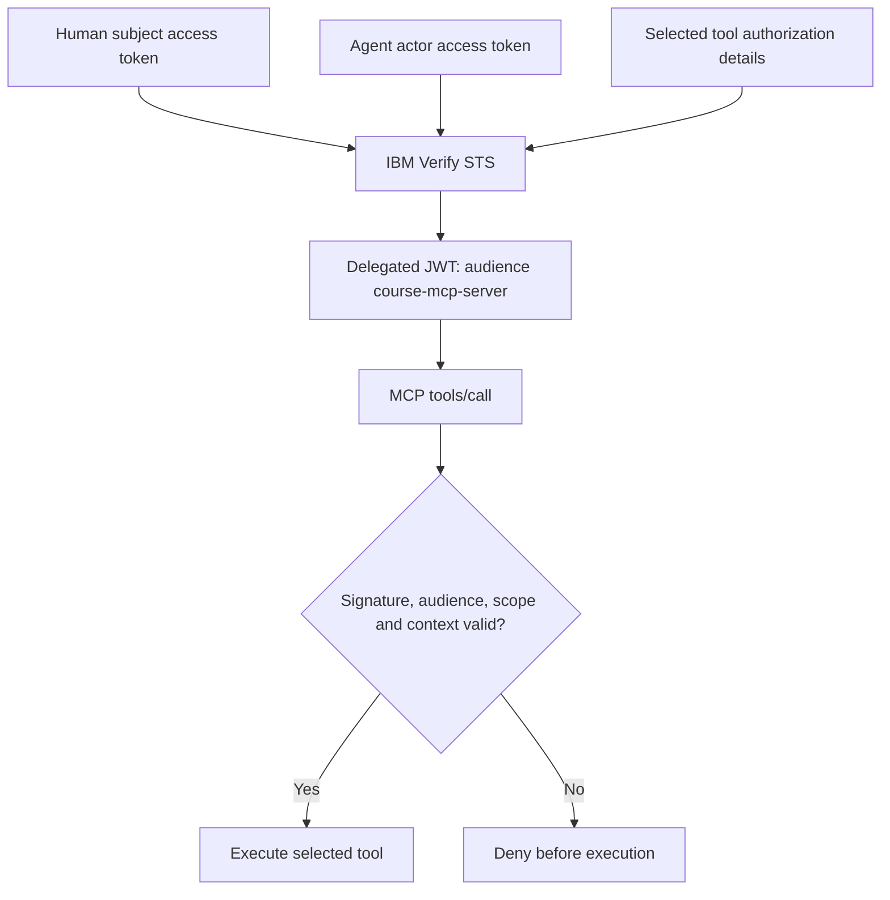
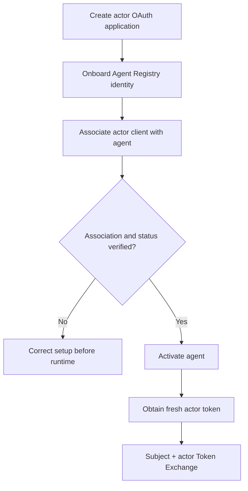
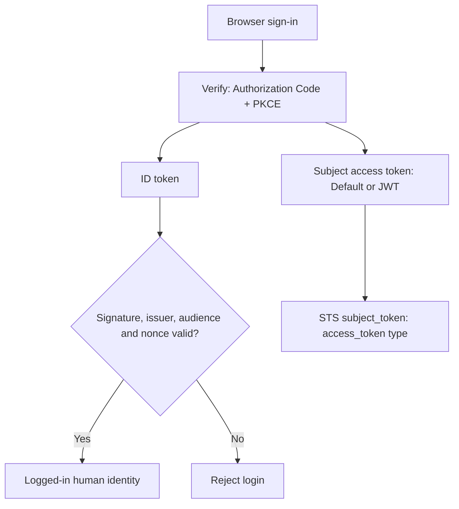
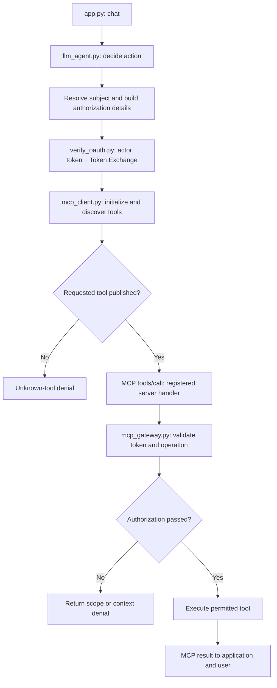
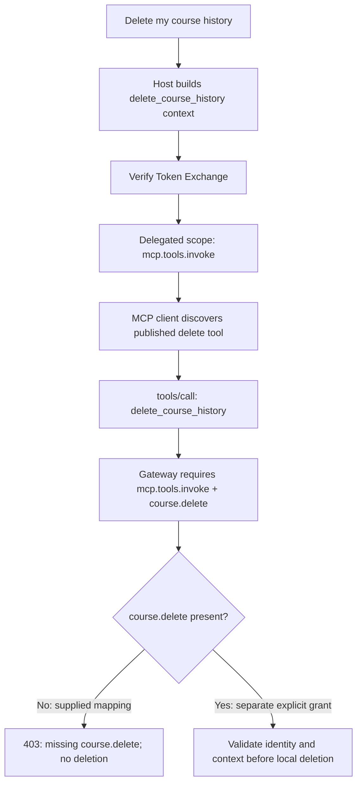
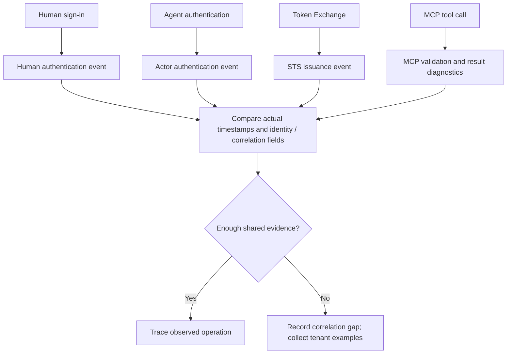
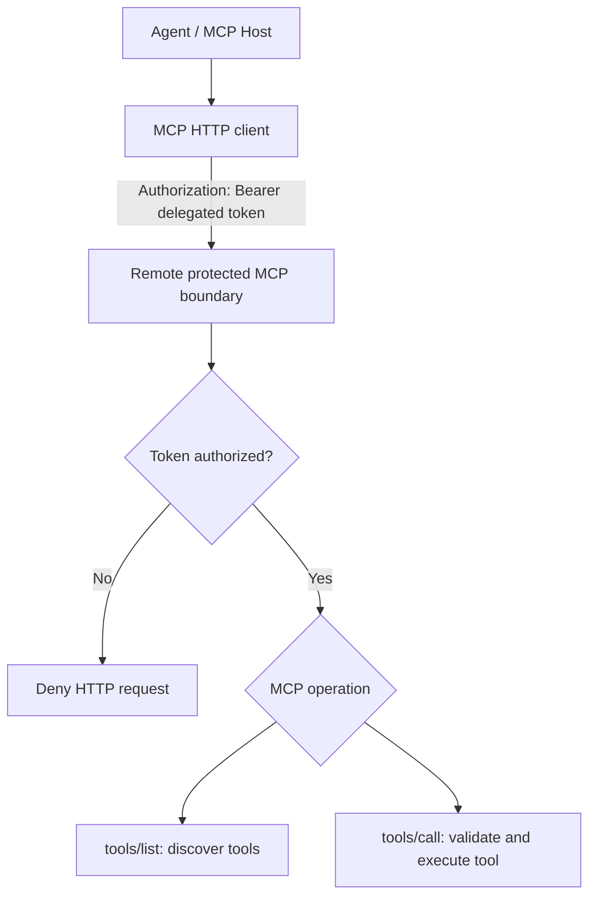
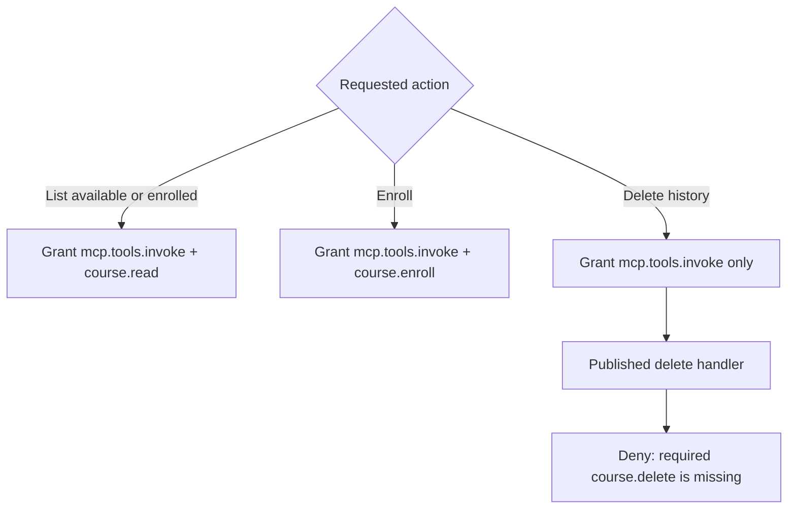

# Onboard & Secure a Conversational AI Agent with MCP Tool Integration

| ⚠️ EARLY ACCESS PREVIEW ⚠️ |
| :--- |
| Agent identity is under the Early Access Program (EAP) and for selected participants. Features and functionality are subject to change in the coming iterations. |

This sample demonstrates how to onboard a conversational AI agent as a governed **agent identity in IBM Verify** and secure the agent when it invokes tools exposed by a **Model Context Protocol (MCP) server** on behalf of a signed-in human user.

The example is a course assistant. A user signs in and asks:

```text
Show me the available courses.
Enroll me in Advanced Security Operations.
Show my enrolled courses.
Show other user enrolled courses.
```

The important difference from a direct-tool sample is **where the tools live and how they are invoked**.


```mermaid
flowchart TD
    A["Agent"] --> Q{"Integration"}
    Q -->|"Direct tools"| D["Python / API function"]
    Q -->|"MCP tools"| C["MCP client"]
    C --> S["MCP server"]
    S --> T["Registered tool"]
```

In this UC2 sample, the FastAPI conversational application is the **MCP Host**. `mcp_client.py` is the **MCP Client**. `mcp_server.py` is the **MCP Server**. The MCP server registers four course tools with `@mcp.tool()` and the client discovers and invokes them with the standard MCP operations `tools/list` and `tools/call`.

Before the protected MCP tool is invoked, the application obtains the human subject token, obtains the registered agent's actor token, constructs MCP-specific authorization details, and asks IBM Verify to issue a delegated token through OAuth 2.0 Token Exchange.

The delegated token then travels with the local MCP tool invocation in this tutorial. The MCP server validates the delegated identity and authorization context before the course operation executes.


## Setup guide

This  exposes four MCP tools, including a delete handler denied by missing `course.delete`.

Steps 1–8 configure Verify and the application; Step 9 verifies MCP discovery; Step 10 exercises tools and suspension; Step 11 reviews the audit evidence.

## Why this sample matters

MCP standardizes how AI applications discover and call tools. An MCP server can expose functions, schemas, and descriptions to an MCP client. However, **tool discovery is not authorization**.

An agent may discover:

```text
list_available_courses
enroll_course
list_enrolled_courses
```

That only means the MCP server exposes those tools. It does not answer:

```text
Who is the human?
Which AI agent is acting?
May this agent act for this human?
Is this token intended for this MCP server?
Is enroll_course allowed for this delegated request?
Does the authorization detail match the actual MCP tool call?
```

IBM Verify is used to carry and evaluate the subject/actor security context before the tool call. The MCP server remains a protected resource boundary and validates the delegated token context before dispatching the tool.

## What the sample demonstrates

- Create the AI agent OAuth client with IBM Verify Dynamic Client Registration (DCR).
- Onboard the Course MCP Conversational Agent in IBM Verify Agent Registry.
- Associate the registered agent with its actor OAuth client.
- Authenticate the human through Authorization Code + PKCE.
- Authenticate the AI agent through Client Credentials.
- Build MCP-specific `authorization_details` containing the selected tool name and target MCP server.
- Exchange subject and actor tokens at IBM Verify STS.
- Request a delegated token for the `course-mcp-server` audience.
- Start a real MCP client session from the agent application.
- Discover server tools using MCP `tools/list`.
- Invoke the selected tool using MCP `tools/call`.
- Validate the delegated token context at the MCP server before tool execution.
- Deny a tool call when the actual MCP tool does not match the authorized `toolName`/`action`.
- Deny cross-user operations in the sample policy.

## MCP roles in this sample

This section is intentionally explicit because the words **agent**, **host**, **client**, and **server** are easy to mix up.

| Component | MCP role | Source file | Responsibility |
|---|---|---|---|
| Conversational Course Agent web app | MCP Host | `app.py` | User interaction, LLM/intent decision, IBM Verify flow, starts MCP calls |
| Course MCP client adapter | MCP Client | `mcp_client.py` | Connects to server, initializes MCP session, calls `tools/list` and `tools/call` |
| Course MCP tool service | MCP Server | `mcp_server.py` | Advertises MCP tools with `@mcp.tool()` |
| MCP authorization/execution boundary | Server-side security adapter | `mcp_gateway.py` | Validates delegated token context and executes permitted course operation |
| IBM Verify | Authorization server / STS | external | Subject authentication, actor token, token exchange and delegated token issuance |

### The one-line answer

```text
app.py is the MCP Host
mcp_client.py is the MCP Client
mcp_server.py is the MCP Server
```

### Who starts the MCP server?

The MCP client uses the official Python SDK `StdioServerParameters`:

```python
server_params = StdioServerParameters(
    command=sys.executable,
    args=[str(SERVER_SCRIPT)],
    env=None,
)
```

For this local tutorial, `mcp_client.py` launches:

```text
python mcp_server.py
```

as a child process and communicates with it over the MCP **STDIO transport**.

### Who is the MCP client?

`mcp_client.py` creates an MCP `ClientSession`:

```python
async with stdio_client(server_params) as (read_stream, write_stream):
    async with ClientSession(read_stream, write_stream) as session:
        await session.initialize()
```

That code is the MCP client connection.

### Who is the MCP server?

`mcp_server.py` creates the MCP server:

```python
from mcp.server.fastmcp import FastMCP

mcp = FastMCP("course-mcp-server")
```

and runs it with:

```python
mcp.run(transport="stdio")
```

### Which tools does the MCP server expose?

The server registers four Python functions as MCP tools:

```python
@mcp.tool()
def list_available_courses(...):
    ...

@mcp.tool()
def list_enrolled_courses(...):
    ...

@mcp.tool()
def enroll_course(...):
    ...

@mcp.tool()
def delete_course_history(...):
    ...
```

FastMCP uses the function name, type hints, and docstring to expose the tool definition to MCP clients.

## Sample architecture


```mermaid
flowchart TD
    U["Human user: browser / chat"] --> H["MCP Host: app.py"]
    U -->|"Authorization Code + PKCE"| V["IBM Verify"]
    V -->|"ID token + subject access token"| H
    H -->|"Actor credentials"| V
    H -->|"Subject + actor + authorization details"| S["Verify STS"]
    S -->|"Delegated MCP token"| H
    H --> C["MCP Client: mcp_client.py"]
    C -->|"STDIO: tools/list + tools/call"| M["MCP Server: mcp_server.py"]
    M --> G["Protected boundary: mcp_gateway.py"]
    G --> Q{"Token, scope and context valid?"}
    Q -->|"No"| D["Deny with validation stage"]
    Q -->|"Yes"| E["Execute authorized local tool"]
    E --> DB["SQLite enrollment store"]
    E -->|"Tool result"| H
```

IBM Verify sits on the identity/token path before the MCP client calls the protected tool:


```mermaid
flowchart TD
    H["Human subject access token"] --> S["IBM Verify STS"]
    A["Agent actor access token"] --> S
    R["Selected tool authorization details"] --> S
    S --> T["Delegated JWT: audience course-mcp-server"]
    T --> M["MCP tools/call"]
    M --> Q{"Signature, audience, scope and context valid?"}
    Q -->|"Yes"| E["Execute selected tool"]
    Q -->|"No"| D["Deny before execution"]
```

## Runtime flow


## Project structure

| File / directory | Role |
|---|---|
| `app.py` | MCP Host and browser login |
| `mcp_client.py` | Initialize, discover and call MCP tools |
| `mcp_server.py` | Register four tools with FastMCP |
| `mcp_gateway.py` | Protected validation and execution |
| `enrollment_store.py` | Local SQLite enrollment persistence |
| `llm_agent.py` | Intent selection |
| `rar_builder.py` | MCP authorization details |
| `verify_oauth.py` | Subject, actor and delegated-token flows |
| `token_utils.py` | ID-token and delegated-token validation |
| `course_api.py` | Optional downstream validation |
| `config.py / .env.example` | Application settings |
| `api-clients/` | Postman and Insomnia collections |
| `payloads/ / curl/` | Schema and setup payloads |
| `docs/` | Walkthroughs and rendered guide |
| `images/` | Reference images |

## Prerequisites

> **Python 3.11 or later is recommended for this sample.**


You also need:

- An IBM Verify tenant with the OAuth/OIDC capabilities used by the sample.
- IBM Verify Agent Registry capability/API enabled in the target environment.
- Permission to configure Dynamic Client Registration.
- Permission to create/register an agent and associate an OAuth client.
- A subject OIDC application.
- An STS/token-exchange client.
- An MCP resource client/audience configuration for `course-mcp-server`.
- The Authorization Details Type used by this sample.
- An applicable IBM Verify STS policy/actor criteria.
- A Gemini API key only when `USE_LLM=true`.

## Step 1 — Create an IBM Verify administrative API client

Configure the API client with the following entitlements:

| **Entitlement** | **API entitlement** | **Why it is required** |
|---|---|---|
| **Configure AI agents** | `writeAgents` | Required to create and update the Agent Registry record used by this sample. |
| **Manage AI agents** | `manageAgentStatus`| Review and manage AI agent status |
| **Manage OIDC client registration dynamically** | `manageOidcDynamicClient` | Required to create the agent OAuth client through Dynamic Client Registration when DCR requires bearer-token authentication. |
| **Manage authorization detail types** | `manageAuthDetailTypes` | Create and manage the Authorization Details Type used by this sample. |
| **Read Users** | `readUsers` | Read all users but not group memberships. |


Do not select unrelated administrative entitlements. They are not required by this sample.

Capture:

```text
admin_client_id=<admin API client ID>
admin_client_secret=<admin API client secret>
```


Obtain the setup token:

```bash
curl --request POST "https://<tenant>/oauth2/token" \
  --header "Content-Type: application/x-www-form-urlencoded" \
  --data-urlencode "grant_type=client_credentials" \
  --data-urlencode "client_id=<admin-client-id>" \
  --data-urlencode "client_secret=<admin-client-secret>"
```

## Step 2 — Create the agent actor client using DCR

DCR is the preferred actor-client creation path in this sample.

```bash
curl --request POST "https://<tenant>/oauth2/register" \
  --header "Authorization: Bearer <admin-access-token>" \
  --header "Content-Type: application/json" \
  --data @curl/payloads/actor-client-dcr.json
```

Capture:

```text
ACTOR_CLIENT_ID=<client_id>
ACTOR_CLIENT_SECRET=<client_secret>
```


### Postman

Import:

```text
api-clients/postman/uc2-ibm-verify-setup.postman_collection.json
```

Run:

```text
01 - Get Admin Access Token
02 - DCR - Create UC2 Actor Client
```

Set `tenant_url`, `admin_client_id`, and `admin_client_secret` in collection variables. The collection saves returned tokens and actor credentials; Insomnia requires manual response copying. For shell commands below, export `TENANT` as the tenant origin and `ADMIN_ACCESS_TOKEN` as request 01’s returned access token.

### Insomnia

Import:

```text
api-clients/insomnia/uc2-ibm-verify-setup.insomnia.json
```

Populate the base environment and run the same numbered requests. Copy returned values into the environment where needed.

## Step 3 — Onboard the AI agent and associate the actor client

The OAuth application created in Step 2 provides the runtime credentials that the Course MCP Agent Application uses to obtain an actor token.

In this step, you register the AI agent in IBM Security Verify's Agent Registry and associate it with that OAuth application.

### Governance and activation flow


```mermaid
flowchart TD
    A["Create actor OAuth application"] --> R["Onboard Agent Registry identity"]
    R --> L["Associate actor client with agent"]
    L --> Q{"Association and status verified?"}
    Q -->|"No"| F["Correct setup before runtime"]
    Q -->|"Yes"| V["Activate agent"]
    V --> T["Obtain fresh actor token"]
    T --> S["Subject + actor Token Exchange"]
```

### Why the Agent Registry record matters

The Agent Registry provides a governed identity for the AI agent, distinct from the OAuth application and its runtime credentials.

The three components serve different purposes:

*Course MCP Agent Application*: Hosts the conversational interface and runs the AI agent.
*Actor OAuth application*: Provides the OAuth client credentials used to obtain an actor token.
*Agent Registry record*: Represents the AI agent as a governed identity and establishes its association with the actor OAuth application.

Associating the OAuth application with the Agent Registry record allows IBM Verify to relate the runtime OAuth identity to the registered AI agent.

This association is important for operational governance and audit because OAuth client credentials can be rotated or replaced while the Agent identity remains stable. The Agent Registry provides a durable governed identity. Runtime events may expose client IDs without the Registry ID; verify the actual event payload before treating it as a correlation key.


### Onboard the agent

Create a new Agent in IBM Verify with the following values:

Display name: UC2 Course MCP Conversational Agent
Description: Conversational AI agent that invokes protected course tools
Tags: course-agent, mcp-tools, conversational-ai

For this tutorial, **Onboard agent** through **one** of the following methods:

- cURL
- Postman
- Insomnia
- IBM Verify UI

### Using cURL
```
curl --request POST "$TENANT/v1.0/Agents" \
  --header "Authorization: Bearer $ADMIN_ACCESS_TOKEN" \
  --header "Accept: application/scim+json" \
  --header "Content-Type: application/scim+json" \
  --data "$(envsubst < curl/payloads/course-mcp-agent.json)"
```

The sample payload uses:

```json
{
  
  "schemas": [
    "urn:ietf:params:scim:schemas:core:ibm:2.0:Agent"
  ],
  "displayName": "UC2 Course MCP Conversational Agents",
  "description": "Conversational AI agent with protected MCP course tools",
  "permissions": [],
  "tags": [
    "course-agent",
    "mcp-tools",
    "conversational-ai"
  ]
}
```
Validate Onboarded Agents 

```
curl --request GET "$TENANT/v1.0/Agents" \
  --header "Authorization: Bearer $ADMIN_ACCESS_TOKEN" \
  --header "Accept: application/scim+json" \
  --header "Content-Type: application/scim+json"   
```

### Postman

* Run **03 - Onboard Agent**<br>
* Run **04 - Get Agent Details**.

### Insomnia

* Run **03 - Onboard Agent**.<br>
* Run **04 - Get Agent Details**.

### With IBM Verify User Interface
* Go to Admin Console, Under **Identities** <br>
* Click AI agents
* Create Agent


Record the generated Agent ID. This is the stable identifier for the governed Agent identity and is also used when associating the Agent OAuth application with the Agent Registry record.

```bash
export AGENT_ID="<agent-id>"
```


### Associate the OAuth application

### Using cURL
```
curl --request PUT "$TENANT/oauth2/register/$ACTOR_CLIENT_ID" \
  --header "Authorization: Bearer $ADMIN_ACCESS_TOKEN" \
  --header "Content-Type: application/json" \
  --data "$(envsubst < curl/payloads/actor-client-dcr-update.json)"  
```

### Postman

* Make sure you have `actor_client_id` and `agent_id` set in the collection/Base Environment<br>
* Run **05 - DCR - Associate Actor Client with Agent**.

### Insomnia

* Make sure you have `actor_client_id` and `agent_id` set in the collection/Base Environment<br>
* Run **05 - DCR - Associate Actor Client with Agent**.


### With IBM Verify User Interface

  To associate the OAuth application after the Agent has been created perform the below steps:

1. Open the Agent in the IBM Verify administration console.
2. Edit the Agent.
3. Go to Identity & authentication.
4. Select the OAuth application created in Step 2: UC2 Course MCP Conversational Agent.
5. Continue through the configuration and save the Agent.
6. Reopen the Agent and verify that the OAuth application is shown under its identity and authentication configuration.


### Activate the Agent

A newly created Agent is not yet ready for runtime use. After associating the Agent OAuth application with the Agent identity, update the Agent status to `ACTIVE`.

The activation payload is provided in:

```text
curl/payloads/course-mcp-agent-activate.json
```

The payload contains:

```json
{
  "schemas": [
    "urn:ietf:params:scim:schemas:core:ibm:2.0:Agent"
  ],
  "displayName": "UC2 Course MCP Conversational Agent",
  "description": "Conversational AI agent with protected MCP course tools",
  "permissions": [],
  "status": "ACTIVE",
  "tags": [
    "course-agent",
    "mcp-tools",
    "conversational-ai"
  ]
}
```

> The `AGENT_ID` used below is the Agent Registry ID returned when the Agent was created earlier in this step.

Choose either **cURL**, **Postman**, or **Insomnia** to activate the Agent.

### Option 1 — Using cURL

Update the Agent using the activation payload:

```bash
curl --request PUT "$TENANT/v1.0/Agents/$AGENT_ID" \
  --header "Authorization: Bearer $ADMIN_ACCESS_TOKEN" \
  --header "Accept: application/scim+json" \
  --header "Content-Type: application/scim+json" \
  --data @curl/payloads/course-mcp-agent-activate.json
```

After the request succeeds, the Agent status should be:

```text
ACTIVE
```

### Option 2 — Using Postman

Create a `PUT` request to:

```text
{{ TENANT }}/v1.0/Agents/{{AGENT_ID}}
```

* Run **06 Activate Agent**.


### Option 3 — Using Insomnia

Create a `PUT` request to:

```text
{{ TENANT }}/v1.0/Agents/{{AGENT_ID}}
```
* Run **06 Activate Agent**.


### Verify the Agent configuration

Regardless of which method was used, verify the final Agent configuration before continuing.

The Agent should now:

- have the display name `UC2 Course MCP Conversational Agent`;
- be associated with the Agent OAuth application created in Step 2; and
- have a status of `ACTIVE`.

For more information about onboarding AI agents, please refer to the IBM documentation:https://www.ibm.com/docs/en/agent-identity?topic=tasks-onboarding-ai-agent

## Step 4 — Configure the human subject application

Create the OIDC application used by the browser chat.

| Setting | Sample value |
|---|---|
| Grant | Authorization Code |
| PKCE | S256 / required |
| Redirect URI | `http://localhost:8000/callback` |
| OIDC scopes | `openid profile email` |
| Subject access-token format | **Default (opaque) is supported; JWT is optional** |
| ID token | Required; used to establish the logged-in Human User |

Capture:

```text
SUBJECT_CLIENT_ID=<subject client ID>
SUBJECT_CLIENT_SECRET=<subject client secret>
```

### Human identity comes from the ID token

The browser login deliberately separates **identity** from the OAuth access token:


```mermaid
flowchart TD
    B["Browser sign-in"] --> V["Verify: Authorization Code + PKCE"]
    V --> ID["ID token"]
    V --> AT["Subject access token: Default or JWT"]
    ID --> Q{"Signature, issuer, audience and nonce valid?"}
    Q -->|"Yes"| I["Logged-in human identity"]
    Q -->|"No"| D["Reject login"]
    AT --> STS["STS subject_token: access_token type"]
```

The application does **not** decode the subject access token to decide who logged in.
Therefore the subject application works whether its access token is JWT-formatted or opaque.
The access token is still sent to Token Exchange as:

```text
subject_token_type=urn:ietf:params:oauth:token-type:access_token
```

`verify_oauth.py` sends an OIDC `nonce` on the authorization request. `app.py` validates the returned `id_token` through `verify_id_token()` and stores only the access token plus validated ID-token claims in the browser session.


### Configure the actor relationship

The subject token represents the signed-in human user. During token exchange, IBM Verify must also validate whether the agent represented by the actor token is permitted to act on behalf of that user.

This sample uses the OAuth may_act relationship for this validation.

1. Open the **Introspect** endpoint configuration.
2. Add an introspection attribute mapping.
3. Select **Custom rule** as the source.
4. In the custom rule, enter:

   ```json
   {
     "sub": "<actor-client-id>"
   }
   ```

   Replace `<actor-client-id>` with the `ACTOR_CLIENT_ID` recorded in Step 2.

5. Set the **Target attribute** to:

   ```text
   may_act
   ```

6. Save the mapping.


The custom rule produces the value of the `may_act` attribute. Conceptually, the resulting introspection response contains:

```json
{
  "may_act": {
    "sub": "<actor-client-id>"
  }
}
```
IBM Verify allows `may_act` to contain one or more properties. If more than one property is included, every property must match the corresponding property in the actor token.

UC2 therefore uses only `sub`, because it is sufficient to identify the permitted actor and avoids unnecessarily requiring two equivalent claim comparisons.

> `ACTOR_CLIENT_ID` is the OAuth client ID of the **Agent OAuth application** created in Step 2. It is not the Agent Registry ID created in Step 3.

### Application entitlements

After completing the Sign-on configuration, configure who is allowed to access the application.

1. Open the **Entitlements** tab for `UC2_subject_token`.
2. Select:

   **All users are entitled to this application**

3. Save the configuration.

This tutorial uses **All users are entitled to this application** so that the test Human User can sign in to the Course MCP Agent Application without requiring an additional user or group assignment.

> **Why is this required?**  

> Creating the OIDC application and enabling the Authorization Code grant does not by itself grant users access to the application. IBM Verify also evaluates the application's entitlement configuration during sign-in. If the signed-in user is not entitled to the application, authentication fails with an error similar to:
>
> ```text
> Only entitled users can single sign-on to the application.
> ```
>
> For this tutorial, allowing all users keeps the setup simple. In a production deployment, access should normally be restricted to the users or groups that are authorized to use the application.


Keep **Skip default actor validation** disabled on the STS client for this `may_act` setup. Actor Criteria is an alternative configuration, not an additional requirement: if your tenant uses it instead, configure an explicit allow rule before skipping the default check. See [Actor criteria](https://www.ibm.com/docs/en/security-verify?topic=clients-actor-criteria).

## Step 5 — Create the MCP Authorization Details Type

The sample uses:

```text
urn:ibm:demo:verify:agent_action
```

Use the exact schema in:

```text
payloads/agent_action_adt_schema.json
```

The actual `rar_builder.py` payload is shaped like:

```json
[
  {
    "type": "urn:ibm:demo:verify:agent_action",
    "courseId": "SEC-301",
    "operationDetails": {
      "creator": "<actor-client-id>",
      "affectedPerson": "<target-subject>",
      "loggedInSubject": "<signed-in-subject>",
      "action": "enroll_course",
      "targetSystem": "course-mcp-server",
      "resource": "mcp-tool",
      "toolName": "enroll_course",
      "downstreamSystem": "course-api"
    }
  }
]
```

The schema included with this package matches these fields exactly.

For this version, the ADT action and `toolName` enums contain four recognized intents:

```text
list_available_courses
list_enrolled_courses
enroll_course
delete_course_history
```

`delete_course_history` is registered as a real MCP tool for the **scope-denial test**. The supplied Verify mapping grants only `mcp.tools.invoke`; the gateway additionally requires `course.delete`, so the published handler is denied before execution.

### Register the ADT with cURL, Postman, Insomnia, or UI

Use UC2's schema, which includes `toolName`, `targetSystem=course-mcp-server`, `resource=mcp-tool`, and `downstreamSystem`. If UC1 already registered the same type name in this tenant, inspect its schema and update it to support these MCP fields before running UC2. Do not blindly create a duplicate or remove fields needed by UC1.

```bash
curl --request POST "$TENANT/oidc-mgmt/v1.0/auth-detail-types" \
  --header "Authorization: Bearer $ADMIN_ACCESS_TOKEN" \
  --header "Content-Type: application/json" \
  --data @payloads/agent_action_adt_registration.json
```

In Postman or Insomnia, run **09 Register MCP ADT** only if the type does not exist. If it exists, use **Applications → Authorization detail types**, open the type, and replace/merge its schema using `payloads/agent_action_adt_schema.json`. For a new type, click **Create → Standard**, enter the type name above, paste that schema and save. Consent-display text may use `{ad.courseId}`; display text does not enforce authorization.

### Why `toolName` matters

The token-exchange request is created **before** the MCP tool call. The authorization detail says:

```text
toolName = enroll_course
```

Later, the MCP client performs:

```python
await session.call_tool("enroll_course", arguments)
```

At the MCP server boundary, `mcp_gateway.py` compares the actual tool invocation with the authorized operation context.

The sample is designed to deny this mismatch:

```text
authorization_details.toolName = list_available_courses
actual MCP tools/call name      = enroll_course
```

Tool discovery therefore does not grant permission to reuse a delegated token for a different tool.

## Step 6 — Configure the STS / Token Exchange client

Configure an IBM Verify STS/token-exchange client for RFC 8693 token exchange.


The application sends:

```text
grant_type          = urn:ietf:params:oauth:grant-type:token-exchange
subject_token        = human access token (JWT or opaque)
subject_token_type   = urn:ietf:params:oauth:token-type:access_token
actor_token          = AI agent access token
actor_token_type     = urn:ietf:params:oauth:token-type:access_token
audience             = course-mcp-server
authorization_details = MCP tool invocation context
```

**There is no hard-coded `scope=` parameter in the Token Exchange request.** The delegated scopes are derived by IBM Verify from the authorization detail that is actually granted.

### Create the STS application in the UI

1. Open **Applications → Add application → OpenID Connect** and name it `UC2 Course MCP Agent Token Exchange`; complete the company name.
2. Under **Sign-on configuration**, enable **Token Exchange** and require an actor token.
3. Set subject and actor token types to `urn:ietf:params:oauth:token-type:access_token`.
4. Under token settings, select **JWT** for the **delegated output access token**, and set audience to `course-mcp-server`. This output format is distinct from the human subject access-token format.
5. Permit `mcp.tools.invoke`, `course.read`, and `course.enroll`, and attach the ADT from Step 5.
6. Leave **Skip default actor validation** disabled for the Step 4 `may_act` configuration.
7. Open **Endpoint configuration → Token → Consent request → Edit** and paste the UC2 mapping below.
8. Configure application entitlements for the test user (or all users for this demo), save, and record `STS_CLIENT_ID` and `STS_CLIENT_SECRET`.

Postman and Insomnia perform runtime Token Exchange after this UI configuration. They do not configure the consent rule or application entitlements. <span style="color:red">TBD: provide tenant-tested management API payloads if API-only subject/STS application provisioning is required.</span>

Configure the STS authorization-details mapping with the following rule:

```yaml
statements:
  - context: >
      authzDetails := has(requestContext.authorization_details)
      ? requestContext.authorization_details.map(x,
          {
            "purpose": x.type,
            "attribute": x.operationDetails.resource,
            "accessType": x.operationDetails.action,
            "value": x.courseId,
            "scope":
              x.operationDetails.action == "list_available_courses"
              ? "mcp.tools.invoke course.read"
              : x.operationDetails.action == "list_enrolled_courses"
                ? "mcp.tools.invoke course.read"
                : x.operationDetails.action == "enroll_course"
                  ? "mcp.tools.invoke course.enroll"
                  : x.operationDetails.action == "delete_course_history"
                    ? "mcp.tools.invoke"
                    : "",
            "tokenClaims": {
              "authorization_details": [x]
            }
          })
      : []

  - return: context.authzDetails
```

This gives the delegated token exactly the authority associated with the approved action:

| ADT action | Scope populated by STS |
|---|---|
| `list_available_courses` | `mcp.tools.invoke course.read` |
| `list_enrolled_courses` | `mcp.tools.invoke course.read` |
| `enroll_course` | `mcp.tools.invoke course.enroll` |
| `delete_course_history` | `mcp.tools.invoke` only |

The protected boundary requires `mcp.tools.invoke` plus the business scope for each of the four tools. The delete handler requires `course.delete`, but the supplied STS mapping never grants it. Keep `course.delete` out of the STS permitted scopes for this negative test.

Capture:

```text
STS_CLIENT_ID=<STS client ID>
STS_CLIENT_SECRET=<STS client secret>
```


Add resource/audience

This sample asks IBM Verify to issue the delegated token for:

```text
course-mcp-server
```

The STS client must be configured to permit the scopes that the authorization-details mapping can produce:

```text
mcp.tools.invoke
course.read
course.enroll
```

The application does not request that broad set. The rule above chooses the minimum output scope for each granted ADT action.


## Step 7 — Configure the application

```bash
cp .env.example .env
```

Populate:

```dotenv
APP_BASE_URL=http://localhost:8000
SESSION_SECRET=<random-local-session-secret>

USE_LLM=false
GEMINI_API_KEY=
GEMINI_MODEL=gemini-2.5-flash

VERIFY_ISSUER=https://<tenant>/oauth2
VERIFY_AUTHORIZATION_ENDPOINT=https://<tenant>/oauth2/authorize
VERIFY_TOKEN_ENDPOINT=https://<tenant>/oauth2/token
VERIFY_JWKS_URI=https://<tenant>/oauth2/jwks
VERIFY_INTROSPECTION_ENDPOINT=https://<tenant>/oauth2/introspect

SUBJECT_CLIENT_ID=<subject-client-id>
SUBJECT_CLIENT_SECRET=<subject-client-secret>
SUBJECT_REDIRECT_URI=http://localhost:8000/callback
SUBJECT_SCOPES=openid profile email

ACTOR_CLIENT_ID=<dcr-created-actor-client-id>
ACTOR_CLIENT_SECRET=<dcr-created-actor-client-secret>
ACTOR_SCOPES=agent.run

STS_CLIENT_ID=<sts-client-id>
STS_CLIENT_SECRET=<sts-client-secret>
STS_AUDIENCE=course-mcp-server

MCP_AUDIENCE=course-mcp-server
MCP_SERVER_NAME=course-mcp-server
DOWNSTREAM_SYSTEM=course-api
MCP_FORWARD_TO_COURSE_API=false
COURSE_API_AUDIENCE=course-api

AGENT_ADT_TYPE=urn:ibm:demo:verify:agent_action
```

For the first run:

```dotenv
USE_LLM=false
```

After the complete IBM Verify and MCP flow works, enable Gemini.

## Step 8 — Install and run

Use Python 3.11–3.13 for the sample; Python 3.14 dependency compatibility has not been validated:

```bash
python3.11 -m venv .venv
source .venv/bin/activate
python -m pip install --upgrade pip
pip install -r requirements.txt

uvicorn app:app --reload --host 0.0.0.0 --port 8000
```

The ID-token change touches `app.py`, `verify_oauth.py`, and `token_utils.py`. `requirements.txt` now explicitly includes PyJWT because `verify_id_token()` validates the ID-token signature with the tenant JWKS.

Open:

```text
http://localhost:8000
```

The MCP server is **not started manually for the basic sample**. `mcp_client.py` launches `mcp_server.py` through `StdioServerParameters` when it establishes the MCP session.

## Step 9 — Prove the MCP server and client are working

Before testing the chat, call:

```bash
curl http://localhost:8000/mcp/tools
```

The FastAPI endpoint calls:

```python
await list_mcp_tools()
```

Inside `mcp_client.py`:

```python
response = await session.list_tools()
```

Expected tool names:

```text
list_available_courses
list_enrolled_courses
enroll_course
```

The response also shows:

```text
protocol_operation = tools/list
```

This proves that the tools were discovered from the MCP server rather than read from an `ALLOWED_ACTIONS` dictionary alone.

## Step 10 — Run the demo

### Test A — List available courses

Prompt:

```text
Show me the available courses.
```

Expected flow:


```mermaid
flowchart TD
    H["app.py: chat"] --> I["llm_agent.py: decide action"]
    I --> R["Resolve subject and build authorization details"]
    R --> V["verify_oauth.py: actor token + Token Exchange"]
    V --> C["mcp_client.py: initialize and discover tools"]
    C --> Q{"Requested tool published?"}
    Q -->|"No"| U["Unknown-tool denial"]
    Q -->|"Yes"| M["MCP tools/call: registered server handler"]
    M --> G["mcp_gateway.py: validate token and operation"]
    G --> P{"Authorization passed?"}
    P -->|"No"| D["Return scope or context denial"]
    P -->|"Yes"| E["Execute permitted tool"]
    E --> O["MCP result to application and user"]
```

### Test B — Enroll the signed-in user

Prompt:

```text
Enroll me in Advanced Security Operations.
```

Expected tool:

```text
enroll_course
```

Expected MCP call:

```python
await session.call_tool(
    "enroll_course",
    {
        "delegated_token": "...",
        "course_id": "SEC-301",
        "requested_subject": "<subject>",
        "logged_in_subject": "<subject>"
    }
)
```

Expected server function:

```python
@mcp.tool()
def enroll_course(...):
```

### Test C — Show the user's enrolled courses

Prompt:

```text
Show my enrolled courses.
```

Expected tool:

```text
list_enrolled_courses
```

### Test D — Named-user lookup and cross-user protection

Prompt:

```text
Can you show John's courses?
```

The behavior is intentionally different depending on authentication and directory state:

| Situation | Expected behavior |
|---|---|
| No Human User is logged in | HTTP `401`; no intent processing, user lookup, Token Exchange, or course data is shown |
| Logged in, but John does not exist or lookup is ambiguous | `USER_RESOLUTION_FAILED`; Token Exchange is not performed |
| Logged in as another user and John exists | John can be resolved, but the MCP cross-user policy denies the course-data request |
| Logged in as John and John resolves to the logged-in subject | The normal `list_enrolled_courses` authorization path can proceed |

This distinction is important: **directory existence is not authorization**. Finding John in IBM Verify never gives another logged-in user permission to see John's courses.

To test named-user resolution, configure `VERIFY_MANAGEMENT_CLIENT_ID` and `VERIFY_MANAGEMENT_CLIENT_SECRET` with permission to read IBM Verify Directory users.

### Test E — Published delete tool is denied by missing scope

Update the existing Verify ADT schema first: both `action` and `toolName` must allow `delete_course_history`. Use the regenerated `payloads/agent_action_adt_schema.json`.

Prompt:

```text
Please delete my course history.
```

Expected authorization context:

```text
action = delete_course_history
delegated scope = mcp.tools.invoke
```

No `course.read`, `course.enroll`, or `course.delete` scope is granted. The published delete handler reaches the gateway, which returns HTTP **403**, `denied_stage="scope"`, and a reason containing **Missing required scope(s)** and **course.delete**. No enrollment data is changed.

In Postman or Insomnia, run runtime request **07 Token Exchange for Delete**, copy the returned delegated token if using Insomnia, then run **08 Invoke Delete**. If you still see “tool is not exposed,” ensure the regenerated `mcp_server.py` is running and discovery shows all four tools.


```mermaid
flowchart TD
    U["Delete my course history"] --> H["Host builds delete_course_history context"]
    H --> V["Verify Token Exchange"]
    V --> T["Delegated scope: mcp.tools.invoke"]
    T --> C["MCP client discovers published delete tool"]
    C --> M["tools/call: delete_course_history"]
    M --> G["Gateway requires mcp.tools.invoke + course.delete"]
    G --> Q{"course.delete present?"}
    Q -->|"No: supplied mapping"| D["403: missing course.delete; no deletion"]
    Q -->|"Yes: separate explicit grant"| E["Validate identity and context before local deletion"]
```

### Test F — Suspend the Agent and verify runtime access is blocked

This test demonstrates the effect of the Agent identity lifecycle on runtime authorization.

First, complete one of the normal operations while the Agent status is `ACTIVE`, for example:

```text
Show me the available courses.
```

or:

```text
Enroll me in Advanced Security Operations.
```

Confirm that the operation succeeds before continuing.

#### Suspend the Agent

The suspension payload is provided in:

```text
curl/payloads/course-mcp-agent-suspend.json
```

The payload contains:

```json
{
  "schemas": [
    "urn:ietf:params:scim:schemas:core:ibm:2.0:Agent"
  ],
  "displayName": "UC2 Course MCP Conversational Agent",
  "description": "Conversational AI agent with protected MCP course tools",
  "permissions": [],
  "status": "SUSPENDED",
  "tags": [
    "course-agent",
    "mcp-tools",
    "conversational-ai"
  ]
}
```
### Using cURL

```bash
curl --request PUT "$TENANT/v1.0/Agents/$AGENT_ID" \
  --header "Authorization: Bearer $ADMIN_ACCESS_TOKEN" \
  --header "Accept: application/scim+json" \
  --header "Content-Type: application/scim+json" \
  --data @curl/payloads/course-mcp-agent-suspend.json
```

### With IBM Verify User Interface
 
 To suspend an Agent using the IBM Verify user interface:

1. Go to Identities → AI agents.
2. Select the Agent that you want to suspend.
3. Open Options for the selected Agent.
4. Select Suspend.

After the operation completes, verify that the Agent status is shown as: SUSPENDED


> The Agent OAuth application remains associated with the Agent identity. 

After suspending the Agent test operation again

```text
Show me the available courses.
```
It should fail.


Run **07 Suspend Agent** in Postman/Insomnia, then **04 Get Agent Details**. Try a new chat operation, which requests a fresh actor token. Record the denial stage and Verify error. Reactivate using **06 Activate Agent** and repeat the operation. Already issued JWTs are not automatically invalidated by a local signature check; this test demonstrates fresh runtime requests after suspension.

## Step 11 — Audit the human, agent, Token Exchange, and MCP tool activity


```mermaid
flowchart TD
    H["Human sign-in"] --> HE["Human authentication event"]
    A["Agent authentication"] --> AE["Actor authentication event"]
    T["Token Exchange"] --> TE["STS issuance event"]
    M["MCP tool call"] --> ME["MCP validation and result diagnostics"]
    HE --> C["Compare actual timestamps and identity / correlation fields"]
    AE --> C
    TE --> C
    ME --> C
    C --> Q{"Enough shared evidence?"}
    Q -->|"Yes"| V["Trace observed operation"]
    Q -->|"No"| D["Record correlation gap; collect tenant examples"]
```


1. In **Reporting & diagnostics → Reports**, select the time window of your test and locate the human sign-in for `UC2_subject_token`: Authorization Code, the signed-in user, and access/ID-token issuance.
2. Locate actor authentication for `UC2 Course MCP Conversational Agent`: Client Credentials, `agent.run`, actor client ID, result and timestamp. Inspect the raw event for agent entity type and Registry ID if available. Do not assume that every UI report displays the Registry ID. If the AI activity report is empty, also check client authentication/application activity reports.
3. Locate `UC2 Course MCP Agent Token Exchange`: grant `urn:ietf:params:oauth:grant-type:token-exchange`, result, subject/actor fields if present, and granted scopes. Listing should show `mcp.tools.invoke course.read`; enrollment should show `mcp.tools.invoke course.enroll`.
4. Compare with application/STDIO server diagnostics: selected tool, MCP server, course ID, authorization-details match, validation stage and actual result. A successfully issued token does not prove that a tool ran or that enrollment succeeded.
5. Repeat for the suspension and cross-user negative tests. Record the failure at actor issuance, STS, or MCP validation rather than claiming all failures occurred at Token Exchange.

| Evidence | What it establishes | What it does not establish alone |
|---|---|---|
| Registry + OAuth association | Governed agent identity, lifecycle and credential association | A particular tool execution or automatic event correlation |
| Human authentication event | Human sign-in and subject application | Which tool later ran |
| Actor authentication event | Runtime client authentication; inspect agent fields where emitted | The whole human-to-tool chain |
| STS event + delegated-token inspection | Token issuance, approved scope/context when present | Business operation success |
| MCP/application diagnostics | Tool dispatch, boundary checks and result | A durable centralized audit trail; local stdout is transient |

Use timestamps and actual client/user/token/correlation fields present in your tenant to correlate these records. Do not invent a shared transaction ID or promise that `AGENT_ID` appears in every event. <span style="color:red">TBD: attach sanitized UC2 human, actor, STS and AI activity event examples from your tenant, including the actual correlation fields and report names.</span>

This package does not add a centralized audit service. For durable end-to-end auditing, persist structured MCP results with the correlation fields exposed by Verify. Keep tokens and secrets out of shared logs.

## Add or change an MCP tool

1. Define a typed function in `mcp_server.py` and decorate it with `@mcp.tool()`. FastMCP publishes its function name, parameters and description automatically.
2. Route the function to `_execute()` so the shared protected boundary validates the delegated token before performing business work.
3. Add the tool’s required scopes to `ACTION_SCOPE_MAP` in `mcp_gateway.py`, and implement its permitted operation in `_execute_tool_locally()`.
4. Add the action and `toolName` to the ADT schema, and update intent parsing if the chat application should select it. Update the Verify ADT if its schema changed.
5. Configure Verify’s consent mapping to grant only the intended scopes. Publishing a tool does not authorize it.
6. Restart the application and verify `/mcp/tools`. All local tools require `mcp.tools.invoke` plus their business scope.

`delete_course_history` is the worked example: it is published, its handler requires `course.delete`, and Verify’s supplied mapping intentionally withholds that scope. A custom tool also needs consistent `action`, `toolName`, audience and resource context.

### Running without the tests folder

The application does not import or discover `tests/`. This distribution omits that folder; deleting it from an older copy does not affect startup or tool calls. The offline checks were run separately during preparation.

## MCP tool registration and invocation

### 1. The server registers tools

`mcp_server.py`:

```python
mcp = FastMCP("course-mcp-server")

@mcp.tool()
def list_available_courses(...):
    ...

@mcp.tool()
def list_enrolled_courses(...):
    ...

@mcp.tool()
def enroll_course(...):
    ...

@mcp.tool()
def delete_course_history(...):
    ...
```

This is the MCP equivalent of publishing a tool catalog.

### 2. The client discovers tools

`mcp_client.py`:

```python
response = await session.list_tools()
```

MCP protocol operation:

```text
tools/list
```

The client obtains the tool names, descriptions, and input schemas from the MCP server.

### 3. The agent chooses the intended action

`app.py`:

```python
decision = decide_action(message)
action = decision.action
```

For:

```text
Enroll me in Advanced Security Operations
```

`llm_agent.py` returns:

```text
action        = enroll_course
course_id     = SEC-301
target_subject= self
```

### 4. IBM Verify authorization happens before the protected tool call

`app.py` builds MCP-specific authorization details and calls:

```python
actor_tokens = await get_actor_token()

exchanged_tokens = await token_exchange(
    subject_token=subject_token,
    actor_token=actor_token,
    authorization_details=authorization_details,
)
```

### 5. The MCP client calls the selected tool

`app.py`:

```python
mcp_result = await call_mcp_tool(
    delegated_token=delegated_token,
    tool_name=action,
    course_id=course_id,
    requested_subject=target_subject,
    logged_in_subject=logged_in_subject,
)
```

`mcp_client.py`:

```python
result = await session.call_tool(tool_name, arguments)
```

MCP protocol operation:

```text
tools/call
```

### 6. The MCP server receives the exact tool call

For `enroll_course`, FastMCP dispatches to:

```python
@mcp.tool()
def enroll_course(...):
```

The server then calls:

```python
invoke_mcp_tool(
    delegated_token=delegated_token,
    tool_name="enroll_course",
    ...
)
```

### 7. The protected MCP boundary validates before execution

`mcp_gateway.py` validates the actual invocation against the delegated token context.

| Validation | Question |
|---|---|
| Audience | Was the token issued for `course-mcp-server`? |
| Actor | Is the expected registered agent context present? |
| Scope | Does the delegated token permit MCP invocation and the business action? |
| ADT type | Is the configured agent-action detail present? |
| `targetSystem` | Is this authorization for this MCP server? |
| `resource` | Is the protected object an MCP tool? |
| `toolName` | Does the authorization match the actual MCP tool called? |
| `action` | Does the authorized business action match the tool? |
| Subject | Does the affected person match the requested subject? |
| Cross-user policy | Is the agent trying to act for another user? |

The business operation executes only after these checks pass.

## Complete source-level call flow


```mermaid
flowchart TD
    H["app.py: chat"] --> I["llm_agent.py: decide action"]
    I --> R["Resolve subject and build authorization details"]
    R --> V["verify_oauth.py: actor token + Token Exchange"]
    V --> C["mcp_client.py: initialize and discover tools"]
    C --> Q{"Requested tool published?"}
    Q -->|"No"| U["Unknown-tool denial"]
    Q -->|"Yes"| M["MCP tools/call: registered server handler"]
    M --> G["mcp_gateway.py: validate token and operation"]
    G --> P{"Authorization passed?"}
    P -->|"No"| D["Return scope or context denial"]
    P -->|"Yes"| E["Execute permitted tool"]
    E --> O["MCP result to application and user"]
```

For a source-focused walkthrough, see:

```text
docs/mcp-client-server-tool-flow.md
```

## Local STDIO transport versus a remote MCP server

This tutorial uses MCP STDIO because it makes the client/server relationship easy to run from one repository:

The MCP client starts `python mcp_server.py` as a local subprocess and connects over STDIO. Each call creates a fresh process; SQLite preserves enrollment writes between calls.

The delegated token is included in the tool arguments so the server-side sample can validate IBM Verify context at the tool boundary.

For a **remote MCP server**, use an MCP HTTP transport and protect the HTTP resource according to the MCP authorization model. The MCP authorization specification requires bearer access tokens in the HTTP `Authorization` header for protected resource requests.

A production remote architecture would look like:


```mermaid
flowchart TD
    H["Agent / MCP Host"] --> C["MCP HTTP client"]
    C -->|"Authorization: Bearer delegated token"| B["Remote protected MCP boundary"]
    B --> Q{"Token authorized?"}
    Q -->|"No"| D["Deny HTTP request"]
    Q -->|"Yes"| R{"MCP operation"}
    R --> L["tools/list: discover tools"]
    R --> T["tools/call: validate and execute tool"]
```

Do not blindly copy the tutorial's `delegated_token` tool argument into a public remote MCP API. The local STDIO approach keeps the sample self-contained; a remote HTTP deployment should integrate bearer-token validation at the MCP HTTP resource boundary.

## What to look for in the logs

The IBM Verify token-exchange request should show:

| Request field | Meaning |
|---|---|
| `subject_token` | Human access token |
| `actor_token` | AI agent access token |
| `audience` | `course-mcp-server` |
| `operationDetails.action` | Selected action |
| `operationDetails.toolName` | Selected MCP tool |

For enrollment:

```text
action   = enroll_course
toolName = enroll_course
```

At the MCP boundary, look for validation stages such as:

```text
audience
actor
scope
authorization_details
target_system
resource
downstream_system
action
tool_name
affected_person
logged_in_subject
cross_user_policy
```

## Verify the delegated token using introspection

Use the MCP resource client:

```bash
curl --request POST "https://<tenant>/oauth2/introspect" \
  --user "<mcp-resource-client-id>:<mcp-resource-client-secret>" \
  --header "Content-Type: application/x-www-form-urlencoded" \
  --data-urlencode "token=<delegated-access-token>"
```

Or use:

```text
api-clients/postman/uc2-runtime-diagnostics.postman_collection.json
```

Run:

```text
01 - Application Health
02 - MCP tools/list through client
03 - MCP tools/call through client
04 - Introspect Delegated Token as MCP Resource
```

## How the code works

### `app.py` — conversational agent and MCP Host

The `/chat` route owns the user interaction and agent orchestration. It does not implement the MCP server.

Its protected path is:


```mermaid
flowchart TD
    H["app.py: chat"] --> I["llm_agent.py: decide action"]
    I --> R["Resolve subject and build authorization details"]
    R --> V["verify_oauth.py: actor token + Token Exchange"]
    V --> C["mcp_client.py: initialize and discover tools"]
    C --> Q{"Requested tool published?"}
    Q -->|"No"| U["Unknown-tool denial"]
    Q -->|"Yes"| M["MCP tools/call: registered server handler"]
    M --> G["mcp_gateway.py: validate token and operation"]
    G --> P{"Authorization passed?"}
    P -->|"No"| D["Return scope or context denial"]
    P -->|"Yes"| E["Execute permitted tool"]
    E --> O["MCP result to application and user"]
```

### `mcp_client.py` — MCP Client

This file is the explicit MCP client.

It imports:

```python
from mcp import ClientSession, StdioServerParameters
from mcp.client.stdio import stdio_client
```

It performs:

```python
await session.initialize()
await session.list_tools()
await session.call_tool(tool_name, arguments)
```

### `mcp_server.py` — MCP Server

This file is the explicit MCP server.

It creates:

```python
mcp = FastMCP("course-mcp-server")
```

and exposes four `@mcp.tool()` functions.

### `mcp_gateway.py` — protected server-side execution boundary

This module verifies the delegated JWT with JWKS, then validates its context and compares the authorization details with the actual MCP tool invocation.

It is called **from the MCP server tool handler**.

### `llm_agent.py` — AI intent decision

The model/fallback parser chooses an allow-listed action. It does not issue a token and does not authorize the tool call.

### `rar_builder.py` — MCP operation context

This module adds MCP-specific fields:

```text
toolName
targetSystem = course-mcp-server
resource = mcp-tool
downstreamSystem = course-api
```

### `verify_oauth.py` — IBM Verify OAuth flow

This module implements:


```mermaid
flowchart TD
    B["Browser sign-in"] --> V["Verify: Authorization Code + PKCE"]
    V --> ID["ID token"]
    V --> AT["Subject access token: Default or JWT"]
    ID --> Q{"Signature, issuer, audience and nonce valid?"}
    Q -->|"Yes"| I["Logged-in human identity"]
    Q -->|"No"| D["Reject login"]
    AT --> STS["STS subject_token: access_token type"]
```

## Using Postman and Insomnia

Follow [the complete setup and runtime walkthrough](docs/setup-and-api-walkthrough.md) for exact request order, variables, UI configuration, subject login, Token Exchange, introspection and lifecycle tests.


### IBM Verify setup collection

```text
api-clients/postman/uc2-ibm-verify-setup.postman_collection.json
api-clients/insomnia/uc2-ibm-verify-setup.insomnia.json
```

### MCP runtime diagnostics

```text
api-clients/postman/uc2-runtime-diagnostics.postman_collection.json
api-clients/insomnia/uc2-runtime-diagnostics.insomnia.json
```

The browser login and dynamic per-prompt token exchange remain in the application because OAuth state, PKCE verifier, signed-in subject, selected tool, course ID, and authorization details are interaction-specific.

## Security controls demonstrated

| Control | Enforcement point |
|---|---|
| Human authentication | IBM Verify authorization flow |
| AI agent authentication | IBM Verify token endpoint |
| Agent/client association | IBM Verify Agent Registry |
| Delegated token issuance | IBM Verify STS / token exchange |
| MCP tool context | Authorization Details Type |
| Tool discovery | MCP Server `tools/list` |
| Tool invocation | MCP Client `tools/call` |
| MCP audience | MCP server-side validation |
| Tool/action match | `mcp_gateway.py` |
| Required scope | `mcp_gateway.py` |
| Cross-user denial | MCP protected-resource policy |

## Production considerations

This repository is a tutorial. Before production use:

- use a remote MCP transport appropriate to your deployment;
- validate bearer tokens at the MCP HTTP resource boundary for remote HTTP servers;
- validate JWT signatures with the issuer JWKS or introspect tokens;
- do not use unverified JWT decoding as the authorization validator;
- do not expose delegated tokens as normal business tool parameters in a remote public MCP API;
- keep LLM tool selection separate from authorization decisions;
- define least-privilege scopes per MCP tool or tool group;
- bind authorization context to the actual `tools/call` operation;
- prevent a token authorized for one tool from being reused for another tool;
- store secrets in a managed secret store;
- remove tutorial token/claim diagnostics;
- audit subject, actor, MCP server, tool name, target resource, authorization result, and tool result.

## Troubleshooting

### `invalid_authorization_details`

Use the included schema:

```text
payloads/agent_action_adt_schema.json
```

It matches the actual UC2 `rar_builder.py` output including:

```text
courseId
loggedInSubject
toolName
downstreamSystem
```

### `/mcp/tools` fails

Confirm the MCP SDK is installed:

```bash
python -c "import mcp; print(mcp.__file__)"
```

Then verify:

```bash
python mcp_server.py
```

The command waits for MCP STDIO messages. Stop it with `Ctrl+C`; it is normally launched by `mcp_client.py`.

### MCP client says the tool is not exposed

Call:

```bash
curl http://localhost:8000/mcp/tools
```

Confirm the selected action exactly matches a tool name returned by `tools/list`.

### Tool/action mismatch

Check:

```text
authorization_details.operationDetails.action
authorization_details.operationDetails.toolName
actual session.call_tool(tool_name, ...)
```

For this sample all three must match.

### Audience validation fails

Align:

```dotenv
STS_AUDIENCE=course-mcp-server
MCP_AUDIENCE=course-mcp-server
MCP_SERVER_NAME=course-mcp-server
```

### Delegated scope is missing or too broad

Do not restore a broad `STS_REQUESTED_SCOPE`. This version intentionally omits `scope` from the Token Exchange request.

Check the STS authorization-details mapping rule and confirm the delegated token contains exactly:


```mermaid
flowchart TD
    A{"Requested action"} -->|"List available or enrolled"| R["Grant mcp.tools.invoke + course.read"]
    A -->|"Enroll"| E["Grant mcp.tools.invoke + course.enroll"]
    A -->|"Delete history"| D["Grant mcp.tools.invoke only"]
    D --> M["Published delete handler"]
    M --> X["Deny: required course.delete is missing"]
```

### Actor token fails

Confirm the DCR-created actor client permits Client Credentials and the requested actor scope is configured.

### Introspection fails with invalid client

Use the MCP resource client credentials. Do not substitute the STS client credentials unless the same client is explicitly configured as the protected resource in your architecture.

## IBM Verify documentation references

- IBM Verify DCR API: https://docs.verify.ibm.com/verify/reference/post_oauth2-register
- IBM Verify token endpoint: https://docs.verify.ibm.com/verify/reference/post_oauth2-token
- IBM Verify OAuth 2.0 Token Exchange: https://docs.verify.ibm.com/verify/docs/oauth-20-token-exchange
- IBM Verify token introspection: https://docs.verify.ibm.com/verify/reference/post_oauth2-introspect
- IBM Verify OAuth 2.0 overview: https://docs.verify.ibm.com/verify/docs/oauth-20

## MCP documentation references

- MCP introduction: https://modelcontextprotocol.io/docs/getting-started/intro
- MCP architecture: https://modelcontextprotocol.io/docs/learn/architecture
- Build an MCP server: https://modelcontextprotocol.io/docs/develop/build-server
- Build an MCP client: https://modelcontextprotocol.io/docs/develop/build-client
- MCP tools specification: https://modelcontextprotocol.io/specification/2025-06-18/server/tools
- Official MCP Python SDK: https://github.com/modelcontextprotocol/python-sdk
