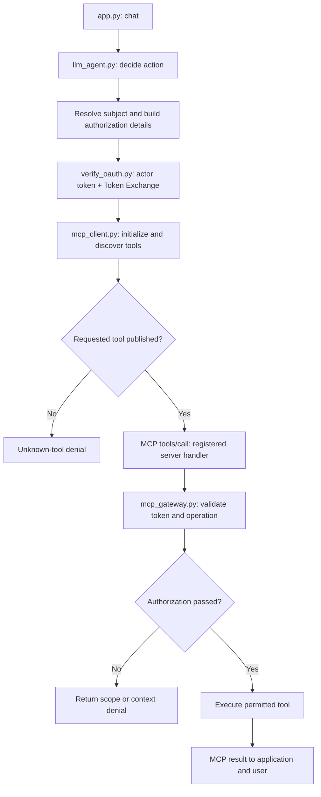
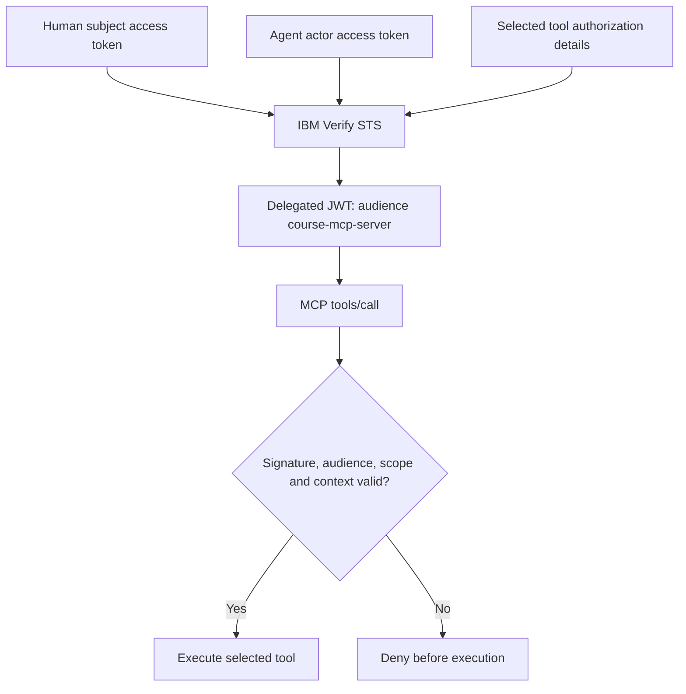
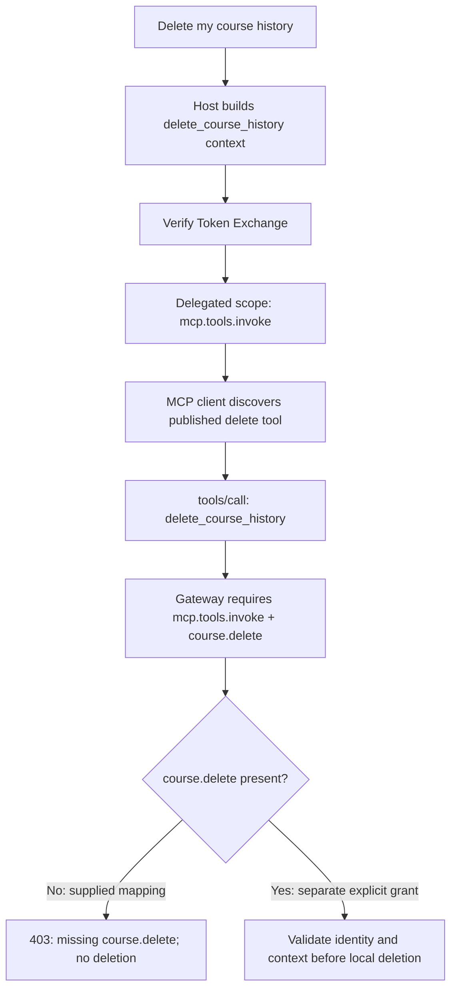

# MCP client, server and protected tools

## Runtime flow

## Protected token flow

## Published tools and required scopes

| MCP tool | Handler | Required business scope |
|---|---|---|
| `list_available_courses` | `mcp_server.list_available_courses()` | `course.read` |
| `list_enrolled_courses` | `mcp_server.list_enrolled_courses()` | `course.read` |
| `enroll_course` | `mcp_server.enroll_course()` | `course.enroll` |
| `delete_course_history` | `mcp_server.delete_course_history()` | `course.delete` |

All four also require `mcp.tools.invoke`. The supplied Verify mapping withholds `course.delete`, so the delete test reaches the handler and fails its scope check.

## Delete denial

The local tutorial uses STDIO and passes the delegated token in tool arguments. Server diagnostics go to stderr; stdout carries MCP protocol messages. Local enrollment writes persist in SQLite across subprocesses.

For remote MCP HTTP deployments, validate bearer tokens at the HTTP resource boundary and use the Authorization header.
