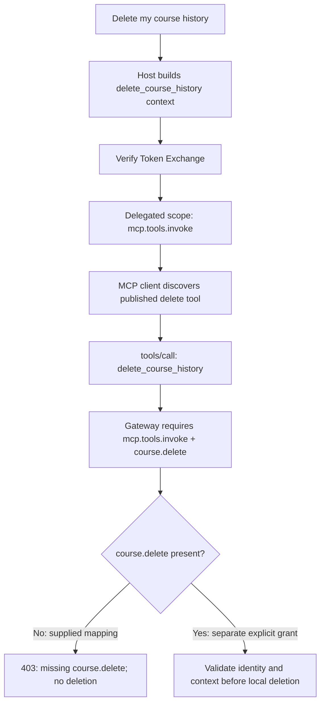

# UC2 setup and API walkthrough

This guide complements README Steps 1–11. Run requests selectively in the order below; do not run the entire setup collection because it includes suspension and optional ADT creation.

## 1. Variables and identities

Import `api-clients/postman/uc2-ibm-verify-setup.postman_collection.json` or `api-clients/insomnia/uc2-ibm-verify-setup.insomnia.json`.

Postman uses collection variables; remove environment overrides for these same names. Postman scripts save successful token, client and agent creation responses. Insomnia uses its Base Environment; copy responses manually.

| Collection variable | Source | Application `.env` equivalent |
|---|---|---|
| `tenant_url` | Tenant origin, e.g. `https://yourtenant.ice.ibmcloud.com`; no `/oauth2` suffix | Endpoint URLs / `VERIFY_ISSUER` |
| `admin_client_id`, `admin_client_secret` | Administrative API client from README Step 1 | `VERIFY_MANAGEMENT_CLIENT_ID`, `VERIFY_MANAGEMENT_CLIENT_SECRET` if directory lookup is used |
| `admin_access_token` | Request 01 `access_token` | Setup only |
| `actor_client_id`, `actor_client_secret` | Request 02 `client_id`, `client_secret` | `ACTOR_CLIENT_ID`, `ACTOR_CLIENT_SECRET` |
| `agent_id` | Request 03 `id` | Setup only; governed identity, not actor client ID |
| `actor_access_token` | Request 08 `access_token` | Runtime test only |
| `resource_client_id`, `resource_client_secret` | Client permitted to introspect the tested token | Diagnostics only |

UI: create an administrative API client with `writeAgents`, `manageAgentStatus`, `manageOidcDynamicClient`, and `manageAuthDetailTypes`. Add `readUsers` when named-user lookup is used. Record the credentials before sending request 01.

## 2. Create, associate, and activate

| Order | Postman / Insomnia request | Method and endpoint | Expected result / next action | UI alternative |
|---|---|---|---|---|
| 1 | 01 Get Admin Access Token | POST `/oauth2/token` | Save `access_token` | API request required to obtain the setup token |
| 2 | 02 DCR Create UC2 Actor Client | POST `/oauth2/register` | Save `client_id`, `client_secret` | Applications → OpenID Connect; enable Client Credentials, `agent.run` |
| 3 | 03 Onboard Agent | POST `/v1.0/Agents` | Save Agent `id`; inspect returned status | Identities → AI agents → Create |
| 4 | 04 Get Agent Details | GET `/v1.0/Agents/{agent_id}` | Verify identity and initial status | Open the agent |
| 5 | 05 DCR Associate Actor Client with Agent | PUT `/oauth2/register/{actor_client_id}` | `extension.entity_id=agent_id`, `entity_type=agent` | Edit agent → Identity & authentication → select actor OAuth application → Save |
| 6 | 06 Activate Agent | PUT `/v1.0/Agents/{agent_id}` | Confirm `ACTIVE` using request 04 | Open agent status/options and activate/review as supported by tenant |
| 7 | 08 Get Actor Token | POST `/oauth2/token` | `agent.run` access token | Runtime request; UI is not a token generator |
| 8 | 10 Introspect Actor Token | POST `/oauth2/introspect` | `active=true`; inspect `sub` and entity fields | Reports provide separate authentication evidence |

Request 05 uses the UC1 DCR association pattern rather than an `oauthClients.issuer` placeholder. For DCR PUT, inspect the existing actor configuration and preserve required metadata if you added settings beyond this sample. Lifecycle PUT payloads are for the sample agent; preserve existing metadata/associations when applying them to a customized agent. Verify association again after activation/suspension.

The SCIM Agent requests need both `Accept: application/scim+json` and `Content-Type: application/scim+json` for bodies. A client ID is not a Registry ID.

For cURL, export `TENANT`, `ADMIN_ACCESS_TOKEN`, `ACTOR_CLIENT_ID`, `ACTOR_CLIENT_SECRET`, and `AGENT_ID` as returned by these operations. README Step 3 contains creation, association and activation commands. Association requires `envsubst` or manual replacement of `${AGENT_ID}` in `curl/payloads/actor-client-dcr-update.json`; never send an unresolved placeholder.

## 3. Configure the human application and actor relationship

UI: **Applications → Add application → OpenID Connect**, name `UC2_subject_token`, complete company name, select Authorization Code, require PKCE S256, redirect `http://localhost:8000/callback`, scopes `openid profile email`. The subject access token can remain **Default**. Configure entitlements for the test user. Record `SUBJECT_CLIENT_ID` and `SUBJECT_CLIENT_SECRET`.

In the subject application **Endpoint configuration → Introspect**, add a custom-rule mapping with target attribute `may_act`:

```json
{"sub":"<ACTOR_CLIENT_ID>"}
```

Use the actor OAuth client ID. Leave the STS **Skip default actor validation** option disabled. Inspect an actual actor token/introspection response to confirm the actor `sub` used by your tenant. If the tenant intentionally uses Actor Criteria, configure an explicit allow condition through that feature instead; do not simply skip delegation validation.

The ID token establishes human identity. The human **access token** remains `subject_token` for Token Exchange. The ID token is not a replacement for that subject access token in this package.

## 4. Register ADT and configure STS

Use request **09 Register MCP ADT** for a new ADT; the request body is the same as `payloads/agent_action_adt_registration.json`. If the type name already exists from the direct-tool sample, inspect and update its schema in **Applications → Authorization detail types** rather than creating a duplicate. Keep fields needed by both samples.

Follow README Step 6 to create `UC2 Course MCP Agent Token Exchange`: Token Exchange grant, actor required, delegated output **JWT**, audience `course-mcp-server`, the three permitted scopes, the ADT attached, entitlements configured, and the UC2 consent mapping rule saved. The mapping selects minimum scopes and returns approved `authorization_details`; the application does not send a broad `scope` in Token Exchange.

| Tool | Delegated scopes | `courseId` |
|---|---|---|
| `list_available_courses` | `mcp.tools.invoke course.read` | `ALL` |
| `list_enrolled_courses` | `mcp.tools.invoke course.read` | `ALL` |
| `enroll_course` | `mcp.tools.invoke course.enroll` | Exact course, e.g. `SEC-301` |
| `delete_course_history` (negative test) | `mcp.tools.invoke` only | `ALL`; published handler requires `course.delete` and is denied |

<span style="color:red">TBD: tenant-tested management APIs for subject/STS application creation, consent-mapping updates, actor mapping and application entitlements. This package uses UI for those configuration operations; do not infer API endpoints.</span>

## 5. Start and obtain a subject token

Copy `.env.example` to `.env`, fill the three application credentials and tenant endpoints, keep `USE_LLM=false`, `MCP_FORWARD_TO_COURSE_API=false`, and `ALLOW_LOCAL_UNSIGNED_JWT=false`. Use the tenant's OIDC discovery values for issuer/JWKS. Run the installation/start commands in README Step 8, then sign in through `http://localhost:8000/login`.

For manual Postman/Insomnia Token Exchange tests, obtain a **separate** human access token with OAuth 2.0 **Authorization Code + PKCE**:

1. In the API client's OAuth helper, set authorization URL `<tenant>/oauth2/authorize`, token URL `<tenant>/oauth2/token`, subject client ID/secret, scopes `openid profile email`, PKCE S256 and a unique state.
2. Register the helper's exact callback URL in the subject application before authorizing. Use the callback URL displayed by your installed client; the browser application's callback stays `http://localhost:8000/callback`.
3. Authorize in the browser and sign in as the intended test user. Use **client credentials in request body** to match this sample.
4. Copy the resulting **access token** to runtime collection `subject_access_token`. Do not copy `id_token` into that field. Populate `logged_in_subject` with the actual validated `preferred_username`, `email`, or `sub` used in the application.

<span style="color:red">TBD: confirm the exact OAuth helper callback URL and supported authentication settings in your installed Postman/Insomnia version.</span>

The API helpers use their own state/PKCE handling. The web application additionally validates ID-token signature, issuer, audience, nonce, and required identity/time claims.

## 6. Run Token Exchange and MCP calls

Import `uc2-runtime-diagnostics` from the Postman or Insomnia directory. Variables in this collection/environment are independent of setup: copy `tenant_url`, `actor_client_id`, a fresh `actor_access_token`, the human `subject_access_token`, `sts_client_id`, and `sts_client_secret`.

1. Run **01 Application Health**, then **02 MCP tools/list through client**. Discovery should return the four registered tools; it does not grant access.
2. Set `tool_name` and `course_id` from the table above, and `logged_in_subject` from the token's human identity.
3. Run **05 Token Exchange for Selected MCP Tool**. Postman stores the delegated token automatically; in Insomnia copy `access_token` to `delegated_access_token`.
4. Optionally run **04 Introspect Delegated Token as MCP Resource** with a client authorized to introspect it. Confirm active status, audience, actor, minimum scope and approved authorization details. STS credentials are not automatically valid introspection credentials.
5. Run **03 MCP tools/call through client**. Repeat Token Exchange for each different operation/course; do not reuse a read token for enrollment.
6. Run **06 Introspect Subject Token and may_act** using `subject_resource_client_id`/secret authorized to introspect the subject application's token. Confirm the allowed actor mapping.

These `/mcp/*` HTTP routes are diagnostics wrappers around the application's MCP client. The actual sample MCP transport is local STDIO (`mcp_server.py` child process); these routes are not a standards-based remote MCP HTTP endpoint.

Equivalent Token Exchange cURL, using `RAR_JSON` containing one MCP authorization detail from `payloads/*_mcp_rar.json` after replacing all identity placeholders:

```bash
curl --request POST "$TENANT/oauth2/token" \
  --header "Content-Type: application/x-www-form-urlencoded" \
  --data-urlencode "grant_type=urn:ietf:params:oauth:grant-type:token-exchange" \
  --data-urlencode "client_id=$STS_CLIENT_ID" \
  --data-urlencode "client_secret=$STS_CLIENT_SECRET" \
  --data-urlencode "subject_token=$SUBJECT_ACCESS_TOKEN" \
  --data-urlencode "subject_token_type=urn:ietf:params:oauth:token-type:access_token" \
  --data-urlencode "actor_token=$ACTOR_ACCESS_TOKEN" \
  --data-urlencode "actor_token_type=urn:ietf:params:oauth:token-type:access_token" \
  --data-urlencode "audience=course-mcp-server" \
  --data-urlencode "authorization_details=$RAR_JSON"
```

The parameter is an array, even though the readable individual payload files contain one object. For example, build `RAR_JSON` with `jq -c '[.]'` after editing a copy of the relevant payload. `creator` is the actor client ID in this package.

## 7. Delete scope-denial test

**Before testing:** update the existing Verify ADT from `payloads/agent_action_adt_schema.json`; both `operationDetails.action` and `operationDetails.toolName` enums now include `delete_course_history`. An older schema can reject the request at STS before the scope demonstration.

The server publishes `delete_course_history`. Its required scopes are `mcp.tools.invoke course.delete`, while Verify grants only `mcp.tools.invoke`.

1. Run **07 Token Exchange for Delete - No Delete Scope**.
2. In Insomnia copy its `access_token` into `delegated_access_token`; Postman saves it automatically.
3. Run **08 Invoke Delete - Expect Scope Denial**.
4. Expect **403**, `denied_stage=scope`, and missing `course.delete`. No data is deleted. A stale server may still return “tool not exposed”; restart using the new package and confirm four discovery results.



The supplied STS allowed scopes and mapping intentionally omit `course.delete`. If a separate trusted policy later grants it, the local handler deletes only that subject’s SQLite enrollment writes, after all identity/context checks. Static example fixtures are unchanged. This handler is a local-store operation even when optional downstream forwarding is enabled.

## 8. Negative tests, lifecycle, and audit

Try enrollment with a read token, a different `course_id` than approved, a different tool name, an altered/expired token, or a different subject. The protected boundary should deny execution. A local tampered-token test proves resource validation, not STS policy.

After an ACTIVE success, run setup **07 Suspend Agent** and **04 Get Agent Details**; try a new chat operation or **08 Get Actor Token**. Record the actual Verify denial stage/error. Reactivate with **06**, verify association/status and repeat. Offline JWT validation does not revoke already issued tokens; verify fresh actor requests for this lifecycle demonstration.

README Step 11 explains the human, actor, STS and MCP evidence and correlation limits. <span style="color:red">TBD: sanitized event examples and actual report/correlation field names from your UC2 tenant; exact suspension error and whether it occurs at actor issuance or STS.</span>

## Package boundaries

The delegated output remains JWT because the gateway verifies it with JWKS before checking MCP audience, actor, minimum scopes, operation/tool/course and identity context. Supporting opaque **delegated output** tokens requires an authenticated introspection path at the MCP boundary; this package supports opaque **human subject** tokens already.

The unsigned-token switch exists only for explicit local demonstrations; keep it false for Verify testing. Enrollment writes use local SQLite so they survive the client’s fresh MCP subprocess for each call. Set `ENROLLMENT_DB_PATH` to choose a location; default is `enrollments.sqlite3` beside the server. The included username-keyed fixture enrollments remain demo data. No centralized audit service has been added.

This remains a localhost tutorial: tokens/claims may appear in its diagnostic UI and the browser session uses signed cookies, not encrypted server-side storage. A remote deployment needs server-side sessions, protected diagnostics, and durable structured audit storage.

## Tests are optional

No application module imports `tests/`. This package excludes the folder; it starts and runs without it. Keep the runtime files, `requirements.txt`, and your `.env`.
